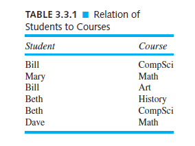
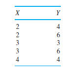
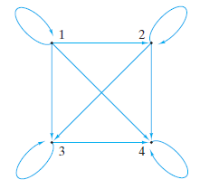

## 3. Relations


Une relation d'un ensemble à un autre peut être considérée comme un tableau qui énumère les éléments du premier ensemble par rapport aux éléments du second ensemble (voir tableau 3.3.1). Le tableau 3.3.1 indique quels étudiants suivent quels cours. Par exemple, Bill suit le cours d'informatique et d'art, et Mary le cours de mathématiques. Dans la terminologie des relations, nous dirions que Bill est lié à l'informatique et aux arts, et que Mary est liée aux mathématiques.

Bien entendu, le tableau 3.3.1 n'est en réalité qu'un ensemble de paires ordonnées. De manière abstraite, nous définissons une relation comme étant un ensemble de paires ordonnées. Dans ce cadre, nous considérons que le premier élément de la paire ordonnée est lié au second élément de la paire ordonnée.



> **Définition.**
>
> Une **relation (binaire)** $R$ entre un ensemble $X$ et un ensemble $Y$ est un sous-ensemble du produit cartésien $X × Y$ . Si $(x, y) ∈ R$, on écrit $x R y$ et on dit que $x$ est lié à $y$. Si $X = Y$ , on appelle $R$ une **relation (binaire)** sur $X$.

Une fonction (voir section 3.1) est un type spécial de relation. Une fonction $f$ de $X$ à $Y$ est une relation de $X$ à $Y$ ayant les propriétés :

(a) Le domaine de $f$ est égal à $X$.
(b) Pour chaque $x ∈ X$, il y a exactement un $y ∈ Y$ tel que $(x, y) ∈ f$ .

**Exemple 3.3.2**

Si nous avons
$X = \{Bill, Mary, Beth, Dave\}$ et $Y = \{CompSci, Math, Art, History\}$,

notre relation $R$ du tableau 3.3.1 peut être écrite

$R = \{(Bill, CompSci), (Mary, Math), (Bill, Art), (Beth, History),(Beth, CompSci), (Dave, Math)\}$.
Comme $(Beth, History) ∈ R$, on peut écrire Beth $R$ History.

L'exemple 3.3.2 montre qu'une relation peut être donnée en spécifiant simplement quelles paires ordonnées appartiennent à la relation.. Notre exemple suivant montre qu'il est parfois possible de définir une relation en donnant une règle d'appartenance à la relation.

**Exemple 3.3.3**

Soient $X = \{2, 3, 4\}$ et $Y = \{3, 4, 5, 6, 7\}$.
Si nous définissons une relation $R$ de $X$ à $Y$ par
$(x, y) ∈ R$ si $x$ divise $y$,
nous obtenons
$R = \{(2, 4), (2, 6), (3, 3), (3, 6), (4, 4)\}$.
Si nous réécrivons $R$ sous forme de tableau, nous obtenons



**Exemple 3.3.4**

Soit $R$ la relation sur $X = \{1, 2, 3, 4\}$ définie par $(x, y) ∈ R$ si $x ≤ y, x, y ∈ X$. Ensuite

$R = \{(1, 1), (1, 2), (1, 3), (1, 4), (2, 2), (2, 3), (2, 4), (3, 3), (3, 4), (4, 4)\}$.



​										Figure 3.3.1 Le digraphe de la relation de l'exemple 3.3.4.

Une façon instructive d'illustrer une relation sur un plateau est de dessiner son **digraphe**. (Les digraphes sont examinés plus en détail au chapitre 8. Pour l'instant, nous ne mentionnons les digraphes qu'en rapport avec les relations). Pour dessiner le digraphe d'une relation sur un ensemble $X$, nous commençons par dessiner des points ou des sommets pour représenter les éléments de $X$. Dans la figure 3.3.1, nous avons dessiné quatre sommets pour représenter les éléments de l'ensemble $X$ de l'exemple 3.3.4. Ensuite, si l'élément $(x, y)$ se trouve dans la relation, nous traçons une flèche (appelée arête dirigée) de $x$ à $y$. Dans la figure 3.3.1, nous avons tracé des arêtes dirigées pour représenter les membres de la relation $R$ de l'exemple 3.3.4. Remarquez qu'un élément de la forme $(x, x)$ dans une relation correspond à un bord dirigé de $x$ à $x$. Un tel bord est appelé **une boucle**. Il y a une boucle à chaque sommet dans la figure 3.3.1.

**Exemple 3.3.5**

La relation $R$ sur $X = \{a, b, c, d\}$ donnée par le digraphe de la figure 3.3.2 est
$R = \{(a, a), (b, c), (c, b), (d, d)\}$.


​										Figure 3.3.2 Le digraphe de la relation de l'exemple 3.3.5.

Nous définissons ensuite plusieurs propriétés que peuvent avoir les relations.

> **Définition 3.3.9**
>
> Une relation $R$ sur un ensemble $X$ est **réflexive** si $(x, x) ∈ R$ pour chaque $x ∈ X$.

**Exemple 3.3.10**

La relation $R$ sur $X = \{1, 2, 3, 4\}$ définie par $(x, y) ∈ R$ si $x ≤ y, x, y ∈ X$, est réflexive car pour chaque élément $x ∈ X, (x, x) ∈ R$ ; plus précisément, $(1, 1), (2, 2), (3, 3)$, et $(4, 4)$ sont chacun dans $R$. Le digraphe d'une relation réflexive comporte une boucle à chaque sommet. Notez que le digraphe de cette relation (voir figure 3.3.1) comporte une boucle à chaque sommet.

Selon les lois de logique généralisées de De Morgan (Théorème 1.5.14), une relation $R$ sur $X$ n'est pas réflexive s'il existe $x ∈ X$ tel que $(x, x) \notin R$.

La relation $R = \{(a, a), (b, c), (c, b), (d, d)\}$

sur $X = \{a, b, c, d\}$ n'est pas réflexif. Par exemple, $b ∈ X$, mais $(b, b)  \notin R$. On peut également voir que cette relation n'est pas réflexive en regardant son digraphe (voir figure 3.3.2) ; le sommet $b$ n'a pas de boucle.

> **Définition 3.3.9**
>
> Une relation $R$ sur un ensemble $X$ est **symétrique** si pour tous $x, y ∈ X$, si $(x, y) ∈ R$, alors $(y, x) ∈ R$.

**Exemple 3.3.10**

La relation $R = \{(a, a), (b, c), (c, b), (d, d)\}$

sur $X = \{a, b, c, d\}$ est symétrique car pour tous les $x, y$, si $(x, y) ∈ R$, alors $(y, x) ∈ R$. Par exemple, $(b, c)$ est dans $R$ et $(c, b)$ est aussi dans $R$. Le digraphe d'une relation symétrique a la propriété que chaque fois qu'il y a un bord dirigé de $v$ à $w$, il y a aussi un bord dirigé de $w$ à $v$. Remarquez que le digraphe de cette relation (voir figure 3.3.2) a la propriété que pour chaque arête dirigée de $v$ à $w$, il y a aussi une arête dirigée de $w$ à $v$.

En symboles, une relation $R$ est symétrique si

$∀x∀y[(x, y) ∈ R] → [(y, x) ∈ R]$.

Ainsi, $R$ n'est pas symétrique si

$\lnot [∀x∀y[(x, y) ∈ R] → [(y, x) ∈ R]]$. (3.3.1)

En utilisant les lois généralisées de De Morgan pour la logique (Théorème 1.5.14) et le fait que
$¬( p →q) ≡ p ∧¬q$ (voir exemple 1.3.13), nous constatons que (3.3.1) est équivalent à

$∃x∃y[[(x, y) ∈ R]∧¬[(y, x) ∈ R]]$

ou, de manière équivalente,

$∃x∃y[[(x, y) ∈ R] ∧ [(y, x) \notin R]]$.

En d'autres termes, une relation $R$ n'est pas symétrique s'il existe $x$ et $y$ tels que $(x, y)$ est dans $R$ et $(y, x)$ n'est pas dans $R$.

**Exemple 3.3.11**

La relation $R$ sur $X = \{1, 2, 3, 4\}$ définie par $(x, y) ∈ R$ si $x ≤ y, x, y ∈ X$, n'est pas symétrique. Par exemple, $(2, 3) ∈ R$, mais$ (3, 2) \notin R$. Le digraphe de cette relation (voir figure 3.3.1) a un bord dirigé de $2$ à $3$, mais il n'y a pas de bord dirigé de $3$ à $2$.

> **Définition 3.3.12**
>
> Une relation $R$ sur un ensemble $X$ est **antisymétrique** si pour tous $x, y ∈ X$, si $(x, y) ∈ R$ et $(y, x) ∈ R$, alors $x = y$.

**Exemple 3.3.13**

La relation $R$ sur $X = \{1, 2, 3, 4\}$ définie par $(x, y) ∈ R$ si $x ≤ y, x, y ∈ X$, est antisymétrique car pour tous les $x, y$, si $(x, y) ∈ R$ (c'est-à-dire $x ≤ y$) et $(y, x) ∈ R$ (c'est-à-dire $y ≤ x$), alors $x = y$.

**Exemple 3.3.14**

Il est parfois plus pratique de remplacer

si $(x, y) ∈ R$ et $(y, x) ∈ R$, alors $x = y$

dans la définition d'"antisymétrique" (définition 3.3.12) avec son contraceptif logiquement équivalent (voir le théorème 1.3.18)

si $x \neq y$, alors $(x, y) \notin R$ ou $(y, x) \notin R$

pour obtenir une caractérisation logiquement équivalente de "antisymétrique" : Une relation $R$ sur un ensemble $X$ est antisymétrique si pour tous $x, y ∈ X$, si $x \neq y$, alors $(x, y) \notin R$ ou $(y, x) \notin R$.

En utilisant cette définition équivalente de "antisymétrique", nous voyons à nouveau que la relation $R$ sur $X = \{1, 2, 3, 4\}$ définie par $(x, y) ∈ R$ si $x ≤ y, x, y ∈ X$, est antisymétrique parce que pour tous les $x, y$, si $x \neq y, (x, y) \notin R$ (c'est-à-dire $x > y$) ou $(y, x) \notin R$ (c'est-à-dire $y > x$).

La caractérisation équivalente d'"antisymétrique" se traduit pour les digraphes comme suit. Le digraphe d'une relation antisymétrique a la propriété qu'entre deux sommets distincts, il y a au plus un bord dirigé. Notez que le digraphe de la relation R du paragraphe précédent (voir figure 3.3.1) a au maximum un bord orienté entre chaque paire de sommets.

**Exemple 3.3.15**

Si une relation n'a pas de membres de la forme $(x, y), x \neq y$, on voit que la caractérisation équivalente de "antisymétrique"

pour tous les $x, y ∈ X$, si $x \neq y$, alors $(x, y) \notin R$ ou $(y, x) \notin R$

(voir exemple 3.3.14) est trivialement vraie (puisque l'hypothèse $x \neq y$ est toujours fausse). Ainsi, si une relation $R$ n'a pas de membres de la forme $(x, y), x \neq y$, $R$ est antisymétrique. 

Par exemple, $R = \{(a, a), (b, b), (c, c)\}$ sur $X = \{a, b, c\}$ est antisymétrique. Le digraphe de $R$ illustré à la figure 3.3.3 a au plus un bord dirigé entre chaque paire de sommets distincts. Notez que $R$ est également réflexive et symétrique. Cet exemple montre que "antisymétrique" n'est pas la même chose que "non symétrique" car cette relation est en fait à la fois symétrique et antisymétrique.


​									Figure 3.3.3 Le digraphe de la relation de l'exemple 3.3.15.

En symboles, une relation R est antisymétrique si

$∀x∀y[(x, y) ∈ R ∧ (y, x) ∈ R] → [x = y]$.

Ainsi, $R$ n'est pas antisymmétrique si

$¬[∀x∀y[(x, y) ∈ R ∧ (y, x) ∈ R] → [x = y]]$. (3.3.2)

En utilisant les lois généralisées de De Morgan pour la logique (Théorème 1.5.14) et le fait que $¬( p →q) ≡ p ∧¬q$ (voir exemple 1.3.13), nous constatons que (3.3.2) est équivalent à

$∃x∃y[(x, y) ∈ R ∧ (y, x) ∈ R]∧¬[x = y]]$

qui, à son tour, équivaut à

$∃x∃y[(x, y) ∈ R ∧ (y, x) ∈ R ∧ (x \neq y)]$.

En d'autres termes, une relation $R$ n'est pas antisymétrique s'il existe $x$ et $y$, $x \neq y$, de sorte que $(x, y)$ et $(y, x)$ sont tous deux dans $R$.

**Exemple 3.3.16**

La relation $R = \{(a, a), (b, c), (c, b), (d, d)\}$
on $X = \{a, b, c, d\}$ n'est pas antisymétrique parce que $(b, c)$ et $(c, b)$ sont tous deux dans $R$. Remarquez que dans le digraphe de cette relation (voir figure 3.3.2), il y a deux bords dirigés entre $b$ et $c$.

> **Définition 3.3.17**
>
> Une relation $R$ sur un ensemble $X$ est **transitive** si pour tous $x, y, z ∈ X$, si $(x, y)$ et $(y, z) ∈ R$, alors $(x, z) ∈ R$.

**Exemple 3.3.18**

La relation $R$ sur $X = \{1, 2, 3, 4\}$ définie par $(x, y) ∈ R$ si $x ≤ y, x, y ∈ X$, est transitive car pour tous les $x, y, z$, si $(x, y) et (y, z) ∈ R$, alors $(x, z) ∈ R$. Pour vérifier formellement que cette relation satisfait à la définition 3.3.17, nous pouvons énumérer toutes les paires de la forme $(x, y)$ et $(y, z)$ dans $R$ et ensuite vérifier que dans chaque cas, $(x, z) ∈ R$ :


En fait, certaines des entrées du tableau précédent étaient inutiles. Si $x = y$ ou $y = z$, il n'est pas nécessaire de vérifier explicitement que la condition

si $(x, y)$ et $(y, z) ∈ R$, alors $(x, z) ∈ R$

est satisfaite car elle sera automatiquement vraie. Supposons, par exemple, que $x = y$ et $(x, y)$ et $(y, z)$ soient dans $R$. Puisque $x = y, (x, z) = (y, z)$ est dans $R$ et la condition est satisfaite.

En éliminant les cas $x = y$ et $y = z$, il ne reste plus qu'à vérifier explicitement que la relation est transitive :


Le digraphe d'une relation transitive a la propriété que chaque fois qu'il y a des bords dirigés de $x$ à $y$ et de $y$ à $z$, il y a aussi un bord dirigé de $x$ à $z$. Notez que le digraphe de cette relation (voir figure 3.3.1) a cette propriété.

En symboles, une relation R est transitive si

$∀x∀y∀z[(x, y) ∈ R ∧ (y, z) ∈ R] → [(x, z) ∈ R]$.

Ainsi, $R$ n'est pas transitive si

$¬[∀x∀y∀z[(x, y) ∈ R ∧ (y, z) ∈ R] → [(x, z) ∈ R]]$. (3.3.3)

En utilisant les lois généralisées de De Morgan pour la logique (Théorème 1.5.14) et le fait que $¬( p →q ) ≡ p ∧¬q$ (voir exemple 1.3.13), nous constatons que (3.3.3) est équivalent à

$∃x∃y∃z[(x, y) ∈ R ∧ (y, z) ∈ R]∧¬[(x, z) ∈ R]$

ou, de manière équivalente,

$∃x∃y∃z[(x, y) ∈ R ∧ (y, z) ∈ R ∧ (x, z) \neq R]$.

En d'autres termes, une relation $R$ n'est pas transitive s'il existe $x, y$ et $z$ tels que $(x, y$ et $(y, z)$ sont dans $R$, mais que $(x, z)$ n'est pas dans $R$.

**Exemple 3.3.19**

La relation $R = \{(a, a), (b, c), (c, b), (d, d)\}$  sur $X = \{a, b, c, d\}$ n'est pas transitive. Par exemple, $(b, c)$ et $(c, b)$ sont dans $R$, mais $(b, b)$ n'est pas dans $R$. Remarquez que dans le digraphe de cette relation (voir figure 3.3.2), il y a des bords dirigés de $b$ à $c$ et de $c$ à $b$, mais il n'y a pas de bord dirigé de $b$ à $b$. Les relations peuvent être utilisées pour ordonner les éléments d'un ensemble. Par exemple, la relation R définie sur l'ensemble des entiers par

$(x, y) ∈ R$ if $x ≤ y$

ordonne les entiers. Remarquez que la relation $R$ est réflexe, antisymétrique et transitive. De telles relations sont appelées des **ordres partiels**.

> **Définition 3.3.20**
>
> Une relation $R$ sur un ensemble $X$ est un ordre partiel si $R$ est réflexif, antisymétrique et transitif.

**Exemple 3.3.21**

Puisque la relation $R$ définie sur les entiers positifs par

$(x, y) ∈ R$ si $x$ divise $y$

est réflexif, antisymétrique et transitif, $R$ est un ordre partiel.

Si $R$ est un ordre partiel sur un ensemble $X$, la notation $x \preceq y$ est parfois utilisée pour indiquer que $(x, y) ∈ R$. Cette notation suggère que nous interprétons la relation comme un ordre des éléments dans $X.$

Supposons que $R$ est un ordre partiel sur un ensemble $X$. Si $x, y ∈ X$ et soit $x \preceq y$ soit $y \preceq x$, nous disons que $x$ et $y$ sont **comparables**. Si $x, y ∈ X$ et $x \npreceq y$ et $y \npreceq x$, nous disons que $x$ et $y$ sont **incomparables**. Si chaque paire d'éléments dans $X$ est comparable, nous appelons $R$ **un ordre total**. La relation inférieure ou égale à sur les entiers positifs est un ordre total puisque, si $x$ et $y$ sont des entiers, soit $x ≤ y$ soit $y ≤ x$. La raison du terme "ordre partiel" est qu'en général certains éléments de $X$ peuvent être incomparables. La relation "divise" sur les entiers positifs (voir exemple 3.3.21) comporte des éléments à la fois comparables et incomparables. Par exemple, $2$ et $3$ sont incompatibles (puisque $2$ ne divise pas $3$ et $3$ ne divise pas $2$), mais $3$ et $6$ sont comparables (puisque $3$ divise $6$).

Les ordres partiels s'appliquent notamment à la planification des tâches.

**Exemple 3.3.22**

**Planification des tâches**

Considérez l'ensemble $T$ des tâches qui doivent être accomplies pour prendre une photo au flash en intérieur avec un appareil photo particulier.

1. Retirer le bouchon de l'objectif.
2. Faire la mise au point de l'appareil photo.
3. Désactivez le verrouillage de sécurité.
4. Allumez le flash.
5. Appuyez sur le bouton photo.

Certaines de ces tâches doivent être effectuées avant d'autres. Par exemple, la tâche $1$ doit être effectuée avant la tâche $2$. Par contre, d'autres tâches peuvent être effectuées dans un ordre quelconque. Par exemple, les tâches $2$ et $3$ peuvent être effectuées dans un ordre quelconque.

La relation $R$ définie sur $T$ par

$i R j$ si $i = j$ ou la tâche $i$ doit être effectuée avant la tâche $j$

ordonne les tâches. Nous obtenons

$R = \{(1, 1), (2, 2), (3, 3), (4, 4), (5, 5), (1, 2), (1, 5), (2, 5), (3, 5), (4, 5)\}$.

Comme $R$ est réflexive, antisymétrique et transitif, il s'agit d'un ordre partiel. Une solution au problème de l'ordonnancement des tâches pour que nous puissions prendre une photo est un ordonnancement total des tâches cohérent avec l'ordre partiel. Plus précisément, nous avons besoin d'un ordre total des tâches

$t_1, t_2, t_3, t_4, t_5$

de sorte que si $t_i R t_j$ , alors $i = j$ ou $t_i$ précède $t_j$ dans la liste. Parmi les solutions, on peut citer

$1, 2, 3, 4, 5$

et

$3, 4, 1, 2, 5$.

Étant donné une relation $R$ de $X$ à $Y$ , nous pouvons définir une relation de $Y$ à $X$ en inversant l'ordre de chaque paire ordonnée dans $R$. La relation inverse généralise la fonction inverse. La définition formelle est la suivante.

Définition 3.3.23

Soit $R$ une relation de $X$ à $Y$ . **L'inverse** de $R$, noté $R^{-1}$, est la relation de $Y$ à $X$ définie par

$R^{-1} = \{(y, x) | (x, y) ∈ R\}$.

**Exemple 3.3.24**

Si nous définissons une relation $R$ de $X = \{2, 3, 4\}$ à $Y = \{3, 4, 5, 6, 7\}$ par

$(x, y) ∈ R$ si $x$ divise $y$,

nous obtenons

$R = \{(2, 4), (2, 6), (3, 3), (3, 6), (4, 4)\}$.

L'inverse de cette relation est

$R^{−1} = \{(4, 2), (6, 2), (3, 3), (6, 3), (4, 4)\}$.

En d'autres termes, nous pourrions décrire cette relation comme "est divisible par".

Si nous avons une relation $R_1$ de $X$ à $Y$ et une relation $R_2$ de $Y$ à $Z$, nous pouvons former la composition des relations en appliquant d'abord la relation $R_1$ et ensuite la relation $R_2$. La composition des relations généralise la composition des fonctions. La définition formelle est la suivante.

>  **Définition 3.3.25**
>
> Soit $R_1$ une relation de $X$ à $Y$ et $R_2$ une relation de $Y$ à $Z$. La composition de $R_1$ et $R_2$, dénommée R2 ◦ R1, est la relation de X à Z définie par
>
> $R_2 \circ  R_1 = \{(x, z) | (x, y) ∈ R_1$ et $(y, z) ∈ R_2$ pour certains $y ∈ Y \}$.

**Exemple 3.3.26**

La composition des relations

$R_1 = \{(1, 2), (1, 6), (2, 4), (3, 4), (3, 6), (3, 8)\}$

et

$R_2 = \{(2, u), (4, s), (4, t), (6, t), (8, u)\}$

est

$R_2 \circ R_1 = \{(1, u), (1, t), (2, s), (2, t), (3, s), (3, t), (3, u)\}$.

Par exemple, $(1, u) ∈ R_2 \circ R_1$ parce que $(1, 2) ∈ R_1$ et $(2, u) ∈ R_2$.

**Exemple 3.3.27**

Supposons que $R$ et $S$ sont des relations transitives sur un ensemble $X$. Déterminez si chacun des $R ∪ S, R ∩ S$, ou $R \circ S$ doit être transitif.

Nous essayons de prouver chacune des trois affirmations. Si nous échouons, nous tenterons de déterminer où notre preuve échoue et utiliserons cette information pour construire un contre-exemple.

Pour prouver que $R ∪ S$ est transitive, nous devons montrer que si $(x, y), (y, z) ∈ R ∪ S$, alors $(x, z) ∈ R∪S$. Supposons que $(x, y), (y, z) ∈ R∪S$. Si $(x, y)$ et $(y, z)$ se trouvent tous deux dans $R$, nous pourrions utiliser le fait que $R$ est transitif pour conclure que $(x, z) ∈ R$ et, par conséquent, $(x, z) ∈ R ∪ S$. Un argument similaire montre que si $(x, y)$ et $(y, z)$ se trouvent tous deux dans $S$, alors $(x, z) \in  R ∪ S$. Mais que se passe-t-il si $(x, y) \in R$ et $(y, z) \in S$ ? Le fait que $R$ et $S$ soient transitifs ne semble pas être d'une grande aide. Nous essayons de construire un contre-exemple dans lequel $R$ et $S$ sont transitifs mais il existe $(x, y) \in R$ et $(y, z) \in S$ tel que$ (x, z) ¸\notin R ∪ S$.

Nous mettons $(1, 2)$ dans $R$ et $(2, 3)$ dans $S$ et nous nous assurons que $(1, 3)$ n'est pas dans $R ∪ S$. En fait, si $R = \{(1, 2)\}$, $R$ est transitif. De même, si $S = \{(2, 3)\}$, $S$ est transitive. Nous avons notre contre-exemple. Nous pourrions écrire notre solution comme suit.

Nous montrons que $R ∪ S$ n'a pas besoin d'être transitive. Soit $R = \{(1, 2)\}$ et $S = \{(2, 3)\}$. Alors $R$ et $S$ sont transitifs, mais $R ∪ S$ n'est pas transitif ; $(1, 2), (2, 3) \in R ∪ S$, mais $(1, 3) ¸\notin R ∪ S$.

Nous nous intéressons ensuite à $R \cap S$. Pour prouver que $R \cap S$ est transitive, nous devons montrer que si $(x, y), (y, z) \in R \cap S$, alors $(x, z) \in R \cap S$. Supposons que $(x, y), (y, z) \in R \cap S$. Alors $(x, y), (y, z) \in R$. Puisque $R$ est transitive, $(x, z) \in R$. De même, $(x, y), (y, z) \in S$, et puisque $S$ est transitive, $(x, z) \in S$. Donc $(x, z) \in R \cap S$. Nous avons prouvé que $R \cap S$ est transitive.

Enfin, considérons $R \circ S$. Pour prouver que $R \circ S$ est transitive, nous devons montrer que si $(x, y), (y, z) \in R \circ S$, alors $(x, z) \in R \circ S$. Supposons que$ (x, y), (y, z) \in R \circ S$. Alors il existe un tel que $(x, a) \in S$ et $(a, y) \in R$ , et il existe $b$ tel que $(y, b) \in S$ et $(b, z) \in R$ . Nous savons maintenant que $(a, y), (b, z) \in R$ , mais le fait que $R$ est transitif ne nous permet pas de déduire quoi que ce soit de $(a, y), (b, z) \in R \circ S$ n'est pas transitive.

Nous nous occuperons de $(1, 2), (2, 3) \in R \circ S$, mais $(1, 3) \notin R \circ S.$ Afin que $(1, 2) \in R \circ  S$, nous devons avoir $(1, a) \in S$ et $(a, 2) \in R$ , pour certains a. Nous avons mis $(1, 5)$ dans $S$ et $(5, 2)$ dans $R$. (Nous avons choisi a pour être un nombre différent de $1, 2$, ou $3$ pour éviter un conflit avec ces nombres. Tout nombre différent de $1, 2, 3$ ferait l'affaire). Jusqu'ici, tout va bien ! Pour $(2, 3) \in R \circ  S$, nous devons avoir $(2, b) \in S$ et $(b, 3) \in R$ , pour certains $b$. Nous avons mis $(2, 6)$ dans $S$ et $(6, 3)$ dans $R$. (Encore une fois, nous avons choisi $b = 6$ pour éviter un conflit avec les autres nombres déjà choisis). Maintenant, $R = \{(5, 2), (6, 3)\}$ et $S = \{(1, 5), (2, 6)\}$. Remarquez que $R$ et $S$ sont transitifs. Nous avons notre contre-exemple. Nous pourrions écrire notre solution comme suit.

Nous montrons que $R \circ  S$ n'a pas besoin d'être transitive. Soit $R = \{(5, 2), (6, 3)\}$ et $S = \{(1, 5), (2, 6)\}$. $R$ et $S$ sont alors transitifs, mais $R \circ  S = \{(1, 2), (2, 3)\}$ n'est pas transitif ;$ (1, 2), (2, 3) \in R \circ  S$, mais $(1, 3) \notin R \circ S$.


**Exercices de révision**

1. Qu'est-ce qu'une relation binaire de $X$ à $Y$ ?
2. Qu'est-ce que le digraphe d'une relation binaire ?
3. Définir une relation réflexive. Donnez un exemple de relation réflexive. Donnez un exemple de relation qui n'est pas réflexive.
4. Définissez une relation symétrique. Donnez un exemple d'une relation symétrique. Donnez un exemple de relation qui n'est pas symétrique.
5. Définissez une relation antisymétrique. Donnez un exemple d'une relation antisymétrique. Donnez un exemple d'une relation qui n'est pas antisymétrique.
6. Définissez une relation transitive. Donnez un exemple d'une relation transitive. Donnez un exemple de relation qui n'est pas transitive.
7. Définissez l'ordre partiel et donnez un exemple d'ordre partiel.
8. Définissez une relation inverse et donnez un exemple de relation inverse.
9. Définissez la composition des relations et donnez un exemple de la composition des relations.


**Exercices**

Dans les exercices 1 à 4, écrivez la relation comme un ensemble de paires ordonnées.

1. 8840     Hammer
   9921     Pliers
   452       Paint
   2207     Carpet

2. a     3
   b     1
   b     4
   c     1
3. Sally     Math
   Ruth     Physics
   Sam     Econ
4. a     a
   b     b

Dans les exercices 5 à 8, écrivez la relation sous forme de tableau.
5. $R = \{(a, 6), (b, 2), (a, 1), (c, 1)\}$
6. $R = \{(Roger, Musique), (Pat, Histoire), (Ben, Math), (Pat, PolySci)\}$
7. La relation $R$ sur $\{1, 2, 3, 4\}$ définie par $(x, y) ∈ R$ si $x^2 ≥ y$
8. La relation $R$ entre l'ensemble X de planètes et l'ensemble Y d'entiers définis par $(x, y) ∈ R$ si $x$ est en position y par rapport au soleil (le plus proche du soleil étant en position $1$, le deuxième plus proche du soleil étant en position $2$, et ainsi de suite)

Dans les exercices 9 à 12, dessinez le digraphe de la relation.

9. La relation de l'exercice 4 sur $\{a, b, c\}$
10. La relation $R =\{(1, 2), (2, 1), (3, 3), (1, 1), (2, 2)\}$ sur $X = \{1, 2, 3\}$
11. La relation $R = \{(1, 2), (2, 3), (3, 4), (4, 1)\}$ sur $\{1, 2, 3, 4\}$
12. La relation de l'exercice 7
Dans les exercices 13 à 16, écrivez la relation comme un ensemble de paires ordonnées.
13. 
14. 
15. 
16. 
17. Trouvez l'inverse (comme un ensemble de paires ordonnées) de chaque relation dans
    Exercices 1 à 16.

Les exercices 18 et 19 se réfèrent à la relation $R$ sur l'ensemble $\{1, 2, 3, 4, 5\}$ défini par la règle $(x, y) ∈ R$ si $3$ divise $x - y$.
18. Énumérer les éléments de $R$. 
19. Énumérer les éléments $R^{-1}$.
20. Répétez les exercices 18 et 19 pour la relation $R$ sur l'ensemble $\{1, 2, 3, 4, 5\}$ défini par la règle $(x, y) ∈ R$ if $x + y ≤ 6$.
21. Répétez les exercices 18 et 19 pour la relation $R$ sur l'ensemble $\{1, 2, 3, 4, 5\}$ défini par la règle $(x, y) ∈ R$ si $x = y - 1$.
22. La relation de l'exercice 20 est-elle réflexive, symétrique, antisymétrique, transitive et/ou un ordre partiel ?
23. La relation de l'exercice 21 est-elle réfléchie, symétrique, antisymétrique, transitive et/ou d'ordre partiel ?
    Dans les exercices 24 à 31, déterminez si chaque relation définie sur l'ensemble des entiers positifs est réflexive, symétrique, antisymétrique, transitive et/ou d'ordre partiel.
24. $(x, y) ∈ R$ si $x = y^2$. 
25. $(x, y) ∈ R$ si $x > y$.
26. $(x, y) ∈ R$ si $x ≥ y$. 
27. $(x, y) ∈ R$ si $x = y$.
28. $(x, y) ∈ R si 3 divise x - y.
29. $(x, y) ∈ R$ si $3$ divise $x + 2y$.
30. $(x, y) ∈ R$ si $x - y = 2$. 
31. $(x, y) ∈ R$ si $|x - y| = 2$.
32. Soit $X$ un ensemble non vide. Définissez une relation sur $\mathcal P(X)$, l'ensemble de puissance de $X$, comme$(A, B) ∈ R$ si $A⊆ B$. Cette relation est-elle réflexive, symétrique, antisymétrique, transitive et/ou d'ordre partiel ?
33. Prouver qu'une relation $R$ sur un ensemble $X$ est antisymétrique si et seulement si pour tous $x, y ∈ X$, si $(x, y) ∈ R$ et $x = y$, alors $(y, x) ∈ R$.
34. Soit $X$ l'ensemble de toutes les chaînes de quatre bits (par exemple, $0011, 0101, 1000$).
    Définissez une relation $R$ sur $X$ comme $s_1 R s_2$ si une sous-chaîne de $s_1$ de longueur $2$ est égale à une sous-chaîne de $s_2$ de longueur $2$. Exemples : $0111 R 1010$ (parce que $0111$ et $1010$ contiennent tous deux $01$). $1110 \not R 0001$ (parce que $1110$ et $0001$ ne partagent pas une sous-chaîne commune de longueur $2$). Cette relation est-elle réflexive, symétrique, antisymétrique, transitive et/ou d'ordre partiel ?
35. Supposons que $R_i$ soit un ordre partiel sur $X_i , i = 1, 2$. Montrons que $R$ est un ordre partiel sur $X_1 × X_2$ si nous définissons
    $(x_1, x_2) R (x_1, x_2)$ si $x_1 R_1 x_1$ et $x_2 R_2 x_2$.
36. Soit $R_1$ et $R_2$ les relations sur $\{1, 2, 3, 4$ données par
    $R_1 = \{(1, 1), (1, 2), (3, 4), (4, 2)\}$
    $R_2 = \{(1, 1), (2, 1), (3, 1), (4, 4), (2, 2)\}$.
    Énumérer les éléments de $R_1 \circ R_2$ et $R_2 \circ R_1$.
    Donnez des exemples de relations sur $\{1, 2, 3, 4\}$ ayant les propriétés spécifiées dans les exercices 37-41.
37. Réflexive, symétrique et non transitif
38. Réflexive, non symétrique et non transitif
39. Réflexive, antisymétrique et non transitif
40. Non réflexif, symétrique, non antisymétrique et transitif
41. Non réflexif, non symétrique et transitif
Soit $R$ et $S$ sont les relations sur X. Déterminez si chaque affirmation des exercices 42 à 54 est vraie ou fausse. Si l'affirmation est vraie, prouvez-la ; sinon, donnez un contre-exemple.
42. Si $R$ est transitive, alors $R^{-1}$ est transitive.
43. Si $R$ et $S$ sont réflexives, alors $R ∪ S$ est réflexive.
44. Si $R$ et $S$ sont réflexives, alors $R ∩ S$ est réflexive.
45. Si $R$ et $S$ sont réflexives, alors $R \circ S$ est réflexive.
46. Si $R$ est réflexive, alors $R^{-1}$ est réflexive.
47. Si $R$ et $S$ sont symétriques, alors $R ∪ S$ est symétrique.
48. Si $R$ et $S$ sont symétriques, alors $R ∩ S$ est symétrique.
49. Si $R$ et $S$ sont symétriques, alors $R \circ S$ est symétrique.
50. Si $R$ est symétrique, alors $R^{-1} est symétrique.
51. Si $R$ et $S$ sont antisymétriques, alors $R ∪ S$ est antisymétrique.
52. Si $R$ et $S$ sont antisymétriques, alors $R ∩ S$ est antisymétrique.
53. Si $R$ et $S$ sont antisymétriques, alors $R \circ S$ est antisymétrique.
54. Si $R$ est antisymétrique, alors $R^{-1}$ est antisymétrique.
55. Combien de relations y a-t-il sur un ensemble d'éléments $n$ ?
Dans les exercices 56 à 58, déterminez si chaque relation $R$ définie sur la collection de tous les sous-ensembles non vides de nombres réels est réflexive, symétrique, antisymétrique, transitive, et/ou un ordre partiel.
56. $(A, B) ∈ R$ si pour chaque $ε > 0$, il existe $a ∈ A$ et $b ∈ B$ avec $|a - b| < ε$.
57. $(A, B) ∈ R$ si pour chaque $a ∈ A$ et $ε > 0$, il existe $b ∈ B$ avec $|a - b| < ε$.
58. $(A, B) ∈ R$ si pour chaque $a ∈ A, b ∈ B$, et $ε > 0$, il existe $a' ∈ A$ et $b' ∈ B$ avec $|a - b'| < ε$ et $|a' - b| < ε$.
59. Qu'est-ce qui ne va pas avec l'argument suivant, qui montre soi-disant que toute relation $R$ sur $X$ qui est symétrique et transitive est réflexive ?
    Soit $x ∈ X$. En utilisant la symétrie, nous avons $(x, y)$ et $(y, x)$ tous deux dans $R$. Puisque $(x, y), (y, x) ∈ R$, par transitivité nous avons $(x, x) ∈ R$. Par conséquent, $R$ est réflexif.


60. Soit $R$ une relation sur un ensemble $E$ qui vérifie les propriétés suivantes :

$\forall a \in E, \neg (aRa)$

$\forall a \in E, \forall b \in E, \forall c \in E : (aRb$ et $bRc) => aRc$.

On définit sur  E une autre relation notée $a \leq b$ par ($aRb$ ou $a=b)$.

La relation $\leq$ sur $E$est-elle :

Réflexive

Antisymétrique

Transitive

61. Soit $E$ un ensemble ordonnné de trois éléments distincts $E=\{a, b, c\}$.

    On considère la relation $R$ définie en donnant tous les couples qui vérifient la relation :

    $aRb, bRc, aRa, bRb, cRc$.

    Dire dans chaque cas si les propriétés sont vérifiées.

    Relation d'ordre

    Relation d'ordre total

    $R$ a un élément maximal

    $R$ a un élément minimal

62. Soit $E$ un ensemble ordonnné de trois éléments distincts $E=\{a, b, c\}$.

    On considère la relation $R$ définie en donnant tous les couples qui vérifient la relation :

    $aRb, bRc, aRc, aRa, bRb, cRc$.

    Dire dans chaque cas si les propriétés sont vérifiées.

    Relation d'ordre

    Relation d'ordre total

    $R$ a un élément maximal

    $R$ a un élément minimal

    $R$ a un plus grand élément

    $R$ a un plus petit élément

63. Soit $E$ un ensemble ordonné de trois éléments distincts $E=\{a, b, c\}$.

    On considère la relation $R$ sur $E$ définie en donnant tous les couples qui vérifient cette relation.

    $aRa, bRb, cRc, aRb, aRc$.

    Dire dans chaque cas si les propriétés sont vérifiées.

    Relation d'ordre

    Relation d'ordre total

    $R$ a un élément maximal

    $R$ a un élément minimal

    $R$ a un plus grand élément

    $R$ a un plus petit élément

64. Soit $E$ un ensemble non vide et $\mathcal P(E)$ l'ensemble des parties de $E$ ordonnées par inclusion.

    Soit $F \subset \mathcal P(E)$, on ordonne également $F$ par inclusion.

    Soit $I=\bigcap_{X \in F}X$ et $V=\bigcup_{X \in F}X$.

    Les propriétés suivantes sont-elles vraies ?

    $F$ est totalement ordonné.

    $F$ est majoré.

    $F$ est minoré.

    $I$ est un minorant.

    $I$ est un élément minimal de $F$.

    $V$ est un majorant.

    $V$ est un élément maximal de $F$.

65. Soit $E$ l'ensemble des intervalles $[a, b]$, $a$ et $b$ ordonnés par inclusion.

    Dire si les propriétés sont vraies :

    $E$ totalement ordonné.

    $E$ a un élément minimum.

    $E$ a un élément maximum.

66. Soit $E$ l'ensemble des intervalles $[0,n]$, avec $n$ entier strictement positif ordonné par inclusion.

    Dire si les propriètés sont vraies :

    $E$ totalement ordonné.

    $E$ a un élément minimum.

    $E$ a un élément maxumum.

67. Soit $E$ l'ensemble des intervalles $]\frac{-1}{n}, \frac{1}{n}[$, avec $n$ entier strictement positif ordonné par inclusion.

    Dire si les propriétés sont vraires :

    $E$ totalement ordonné.

    $E$ a un élément minimum.

    $E$ a un élémént maximum

68. Soit $R$ une relation symétrique et transitive sur un ensemble $E$. Trouver l’erreur dans le raisonnement suivant : $R$  étant symétrique, $xRy ⇒ yRx$ ; comme $R$ est transitive, $(xRy$ et $yRx) ⇒ xRx$. On en déduit que $R$ est réflexive.

69. Soit $E:= \mathbb R^{\mathbb R}$ l’ensemble des applications de $\mathbb R$ dans $\mathbb R$. On considère la relation $⪯$ définie sur $E$ par: pour tout $f,g∈E$,

    $f⪯g⟺∀x∈R,f(x)≤g(x)$.

    1. Montrer que $⪯$ est une relation d’ordre sur $E$. Cet ordre est-il partiel ? total ?

    2. Interpréter $≺$ pour un couple quelconque $(f,g)∈E^2$.

    3. Donner des exemples d’applications $f$ et $g$ de $E$ satisfaisant $f≺g$.

    4. Soit $(f,g)∈E^2$. A-t-on l’équivalent

       $f≺g⟺(f(x)<g(x),∀x∈R)$?


### 3.4  Relations d'équivalence

Supposons que nous ayons un ensemble $X$ de $10$ boules, chacune étant soit rouge, bleue ou verte (voir figure 3.4.1). Si nous divisons les boules en ensembles $R$, $B$ et $V$ selon la couleur, la famille $\{R, B, V\}$ est une partition de $X$. (Rappelons qu'au point 1.1, nous avons défini une partition d'un ensemble $X$ comme étant une collection $\mathcal S$ de sous-ensembles non vides de $X$, de sorte que chaque élément de $X$ appartient à un membre de $\mathcal S$ exactement).

Une partition peut être utilisée pour définir une relation. Si $\mathcal {S}$ est une partition de $X$, nous pouvons définir $x R y$ pour signifier que pour un certain ensemble $S ∈ \mathcal S$, $x$ et $y$ appartiennent tous deux à $S$. Pour l'exemple de la figure 3.4.1, la relation obtenue pourrait être décrite comme "est de la même couleur que". Le théorème suivant montre qu'une telle relation est toujours réflexive, symétrique et transitive.


​												Figure 3.4.1 Un ensemble de boules colorées.

>  **Théorème 3.4.1** Soient $\mathcal S$ une partition d'un ensemble $X$. Définir $x R y$ signifie que pour un ensemble $S$ dans $\mathcal S$, $x$ et $y$ appartiennent tous deux à $S$. Alors $R$ est réflexive, symétrique et transitif. 

Preuve Soit $x ∈ X$. Selon la définition de la partition, $x$ appartient à un membre $S$ de $\mathcal S$. Ainsi $x R x$ et $R$ est réflexive.

Supposons que $x R y$. Alors $x$ et $y$ appartiennent tous deux à un certain ensemble $S ∈ \mathcal S$. Puisque $y$ et $x$ appartiennent tous deux à $S$, $y R x$ et $R$ est symétrique.

Enfin, supposons que $x R y$ et $y R z$. Alors $x$ et $y$ appartiennent tous deux à un ensemble $S ∈ \mathcal S$ et $y$ et $z$ à un ensemble $T ∈ \mathcal S$. Puisque $y$ appartient à un membre exactement de $\mathcal S$, nous devons avoir $S = T$ . Par conséquent, $x$ et $z$ appartiennent tous deux à $S$ et $x R z$. Nous avons montré que $R$ est transitif.

**Exemple 3.4.2** Considérons la partition

$\mathcal S = \{\{1, 3, 5\}, \{2, 6\}, \{4\}\}$

de $X = \{1, 2, 3, 4, 5, 6\}$. La relation $R$ sur $X$ donnée par le Théorème 3.4.1 contient les paires ordonnées $(1, 1), (1, 3)$, et$ (1, 5)$ car $\{1, 3, 5\}$ est dans $\mathcal S$. La relation complète est

$R = \{(1, 1), (1, 3), (1, 5), (3, 1), (3, 3), (3, 5), (5, 1), (5, 3), (5, 5), (2, 2), (2, 6), (6, 2), (6, 6), (4, 4)\}$.

Soit $\mathcal S$ et $R$ comme dans le Théorème 3.4.1. Si $S ∈ \mathcal S$, on peut considérer les membres de $S$ comme équivalents au sens de la relation $R$, ce qui motive les relations d'appel qui sont des relations d'équivalence réflexive, symétrique et transitive. Dans l'exemple de la figure 3.4.1, la relation est "est de la même couleur que" ; donc équivalent signifie "est de la même couleur que". Chaque ensemble dans la partition est constitué de toutes les boules d'une couleur particulière.

> **Définition 3.4.3** Une relation qui est réflexive, symétrique et transitive sur un ensemble $X$ est appelée relation d'équivalence sur $X$.

**Exemple 3.4.4** La relation $R$ de l'exemple 3.4.2 est une relation d'équivalence sur $\{1, 2, 3, 4, 5, 6\}$ en raison du théorème 3.4.1. Nous pouvons également vérifier directement que $R$ est réflexive, symétrique et transitive.


​										Figure 3.4.2 Le digraphe de la relation de l'exemple 3.4.2.

Le digraphe de la relation $R$ de l'exemple 3.4.2 est présenté dans la figure 3.4.2. Là encore, nous voyons que $R$ est réflexive (il y a une boucle à chaque sommet), symétrique (pour chaque arête dirigée de $v$ à $w$, il y a également une arête dirigée de $w$ à $v$) et transitif (s'il y a une arête dirigée de $x$ à $y$ et une arête dirigée de $y$ à $z$, il y a une arête dirigée de $x$ à $z$).

**Exemple 3.4.5** Considérons la relation

$R = \{(1, 1), (1, 3), (1, 5), (2, 2), (2, 4), (3, 1), (3, 3), (3, 5), (4, 2), (4, 4), (5, 1), (5, 3), (5, 5)\}$

sur $\{1, 2, 3, 4, 5\}$. La relation est réflexive car $(1, 1), (2, 2), (3, 3), (4, 4), (5, 5) ∈ R$. La relation est symétrique car chaque fois que $(x, y)$ est dans $R, (y, x)$ est aussi dans $R$. Enfin, la relation est transitive parce que lorsque $(x, y)$ et $(y, z)$ sont dans $R, (x, z)$ est également dans $R$. Puisque $R$ est réflexive, symétrique et transitif, $R$ est une relation d'équivalence sur $\{1, 2, 3, 4, 5\}$.

**Exemple 3.4.6** La relation $R$ sur $X = \{1, 2, 3, 4\}$ définie par $(x, y) \in R$ si $x \leq y, x, y \in X$, n'est pas une relation d'équivalence car $R$ n'est pas symétrique. [Par exemple, $(2, 3)  \in R$, mais $(3, 2) \notin R$.] La relation $R$ est réflexive et transitive.

**Exemple 3.4.7** La relation

$R = \{(a, a), (b, c), (c, b), (d, d)\}$

sur $X = \{a, b, c, d\}$ n'est pas une relation d'équivalence car $R$ n'est ni réflexive ni transitive. [Elle n'est pas réflexive parce que, par exemple, $(b, b) \notin R$. Elle n'est pas transitive parce que, par exemple, $(b, c)$ et $(c, b)$ sont dans $R$, mais $(b, b)$ n'est pas dans $R$.]

Étant donné une relation d'équivalence sur un ensemble $X$, nous pouvons partitionner $X$ en regroupant les membres apparentés de $X$. Les éléments liés les uns aux autres peuvent être considérés comme équivalents. Le théorème suivant donne les détails.

> **Théorème 3.4.8** Soit $R$ une relation d'équivalence sur un ensemble $X$. Pour chaque $x \in X$, soit
> $[a] = \{x \in X | x Ra\}$.

(En d'autres termes, $[a]$ est l'ensemble de tous les éléments de $X$ qui sont liés à $a$.) Ensuite
$S = \{[a] | a \in X\}$ est une partition de $X$.

Preuve Nous devons montrer que chaque élément de $X$ appartient à un membre de $\mathcal S$ exactement.
Soit $a \in X$. Puisque $aRa$, $a \in [a]$. Ainsi, chaque élément de $X$ appartient à au moins un membre de $\mathcal S$. Il reste à montrer que chaque élément de $X$ appartient à exactement un membre de $\mathcal S$ ; c'est-à-dire,

si $x \in X$ et $x \in [a] \cap [b]$, alors $[a] = [b]$. (3.4.1)

Nous montrons d'abord que pour tous les $c, d \in X$, si $c R d$, alors $[c] = [d]$. Supposons que $c R d$. Soit $x \in [c]$. Ensuite, $x Rc$. Puisque $c R d$ et $R$ est transitive, $x Rd$. Par conséquent, $x \in [d]$ et $[c] \subseteq [d]$. L'argument selon lequel $[d] \subseteq [c]$ est le même que celui qui vient d'être donné, mais avec les rôles de $c$ et $d$ échangés. Ainsi, $[c] = [d]$.

Nous prouvons maintenant (3.4.1). Supposons que $x \in X$ et $x \in [a] \cap [b]$. Alors $x Ra$ et $x Rb$. Notre résultat précédent montre que $[x] = [a]$ et $[x] = [b]$. Donc $[a] = [b]$.

> **Définition 3.4.9** Soit $R$ une relation d'équivalence sur un ensemble $X$. Les ensembles $[a]$ définis dans le Théorème 3.4.8 sont appelés **les classes d'équivalence** de $X$ données par la relation $R$.

**Exemple 3.4.10** Dans l'exemple 3.4.4, nous avons montré que la relation

$R = \{(1, 1), (1, 3), (1, 5), (3, 1), (3, 3), (3, 5), (5, 1), (5, 3), (5, 5), (2, 2), (2, 6), (6, 2), (6, 6), (4, 4)\}$

sur $X = \{1, 2, 3, 4, 5, 6\}$ est une relation d'équivalence. La classe d'équivalence $[1]$ contenant $1$ est constituée de tous les $x$ tels que $(x, 1) \in R$. Par conséquent,  $[1] = \{1, 3, 5\}$.

Les autres classes d'équivalence se retrouvent de la même manière :

$[3] = [5] = \{1, 3, 5\}, [2] = [6] = \{2, 6\}, [4] = \{4\}$.

**Exemple 3.4.11** Les classes d'équivalence apparaissent très clairement dans le digraphe d'une relation d'équivalence. Les trois classes d'équivalence de la relation R de l'exemple 3.4.10 apparaissent dans le digraphe de $R$ (illustré à la figure 3.4.2) comme les trois sous-graphes dont les sommets sont $\{1, 3, 5\}, \{2, 6\}$ et $\{4\}$. Un sous-graphe $G$ qui représente une classe d'équivalence est le plus grand sous-graphe du digraphe original ayant la propriété que pour tout sommet $v$ et $w$ dans $G$, il y a un bord dirigé de $v$ à $w$. Par exemple, si $v, w ∈ \{1, 3, 5\}$, il y a un bord dirigé de $v$ à $w$. De plus, aucun sommet supplémentaire ne peut être ajouté à $1, 3, 5$, et donc l'ensemble de sommets résultant a un bord dirigé entre chaque paire de sommets.

**Exemple 3.4.12** Il existe deux classes d'équivalence pour la relation d'équivalence

$R = \{(1, 1), (1, 3), (1, 5), (2, 2), (2, 4), (3, 1), (3, 3), (3, 5), (4, 2), (4, 4), (5, 1), (5, 3), (5, 5)\}$

sur les $\{1, 2, 3, 4, 5\}$ de l'exemple 3.4.5, à savoir

$[1] = [3] = [5] = \{1, 3, 5\}, [2] = [4] = \{2, 4\}$.

**Exemple 3.4.13** Nous pouvons facilement vérifier que la relation

$R = \{(a, a), (b, b), (c, c)\}$

sur $X = \{a, b, c\}$ est réflexive, symétrique et transitive. Ainsi, R est une relation d'équivalence. Les classes d'équivalence sont

$[a] = \{a\}, [b] = \{b\}, [c] = \{c\}$.

**Exemple 3.4.14** Soit $X = \{1, 2, . . . , 10\}$. Définissons $x R y$ comme signifiant que $3$ divise $x -y$. Nous pouvons facilement vérifier que la relation $R$ est réflexive, symétrique et transitive. Ainsi, $R$ est une relation d'équivalence sur $X$.

Déterminons les membres des classes d'équivalence. La classe d'équivalence $[1]$ est constituée de tous les $x$ avec $x R1$. Ainsi

$[1] = \{x ∈ X | 3$ divise $x - 1\} = \{1, 4, 7, 10\}$.

De même,

$[2] = \{2, 5, 8\}, [3] = \{3, 6, 9\}$.

Ces trois ensembles partitionnent $X$. Notez que

$[1] = [4] = [7] = [10], [2] = [5] = [8], [3] = [6] = [9]$.

Pour cette relation, l'équivalence est "a le même reste lorsqu'il est divisé par $3$".

**Exemple 3.4.15** Nous montrons que si une relation $R$ sur un ensemble $X$ est symétrique et transitive mais non réflexive, la collection d'ensembles $[a], a ∈ X$, définie dans le Théorème 3.4.8 ne partitionne pas $X$ (voir aussi les exercices 44-48).

Soit $R$ une relation sur un ensemble $X$ qui est symétrique et transitif mais non réflexive. Nous définissons des "classes de pseudo-équivalence" comme dans le Théorème 3.4.8 :

$[a] = \{x ∈ X | x Ra\}$.

Comme $R$ n'est pas réflexive, il existe $b ∈ X$ tel que $(b, b) ∈ R$. Nous montrons que $b$ n'est dans aucune classe de pseudo-équivalence. Supposons, à titre de contradiction, que $b ∈ [a]$ pour certains $a ∈ X$. Alors $(b, a) ∈ R$. Puisque $R$ est symétrique, $(a, b) ∈ R$. Puisque $R$ est transitive, $(b, b) ∈ R$. Mais nous avons supposé que $(b, b) ∈ R$. Cette contradiction montre que $b$ n'est dans aucune classe de pseudo-équivalence. Ainsi, la collection des classes de pseudo-équivalence ne partitionne pas $X$.

Nous concluons cette section en prouvant un résultat spécial dont nous aurons besoin plus tard (voir les sections 6.2 et 6.3). La preuve est illustrée dans la figure 3.4.3.


​										Figure 3.4.3 La preuve du théorème 3.4.16.

> **Théorème 3.4.16** Soit $R$ une relation d'équivalence sur un ensemble fini $X$. Si chaque classe d'équivalence a r éléments, il y a $|X|/r$ classes d'équivalence.

Preuve Soit $X_1, X_2, . . ., X_k$ désignent les classes d'équivalence distinctes. Puisque ces ensembles partitionnent X,

$|X| = |X_1| + |X_2| + ... + |X_k| = r + r + ... +r = kr$

et la conclusion suit.


 **Exercices de révision**

1. Définir la relation d'équivalence. Donnez un exemple de relation d'équivalence. Donnez un exemple d'une relation qui n'est pas une relation d'équivalence.

2. Définir la classe d'équivalence. Comment désigne-t-on une classe d'équivalence ? Donnez un exemple de classe d'équivalence pour votre relation d'équivalence de l'exercice 1.

3. Expliquez la relation entre une partition d'un ensemble et une relation d'équivalence.

**Exercices**

Dans les exercices 1-8, déterminez si la relation donnée est une relation d'équivalence sur $\{1, 2, 3, 4, 5\}$. Si la relation est une relation d'équivalence, indiquez les classes d'équivalence. (Dans les exercices 5-8, $x, y ∈ \{1, 2, 3, 4, 5\}$.)

1. $\{(1, 1), (2, 2), (3, 3), (4, 4), (5, 5), (1, 3), (3, 1)\}$

2. $\{(1, 1), (2, 2), (3, 3), (4, 4), (5, 5), (1, 3), (3, 1), (3, 4), (4, 3)\}$

3. $\{(1, 1), (2, 2), (3, 3), (4, 4)\}$

4. $\{(1, 1), (2, 2), (3, 3), (4, 4), (5, 5), (1, 5), (5, 1), (3, 5), (5, 3), (1, 3), (3, 1)\}$

5. $\{(x, y) | 1 ≤ x ≤ 5$ et $1 ≤ y ≤ 5\}$

6. $\{(x, y) | 4$ divise $x - y\}$

7. $\{(x, y) | 3$ divise $x + y\}$ 

8. $\{(x, y) | x$ divise $2 - y\}$

Dans les exercices 9 à 14, déterminez si la relation donnée est une relation d'équivalence sur l'ensemble des personnes.

9. $\{(x, y) | x$ et $y$ ont la même hauteur$\}$

10. $\{(x, y) | x$ et $y$ ont, à un moment donné, vécu dans le même pays$\}$

11. $\{(x, y) | x$ et $y$ ont le même prénom$\}$

12. $\{(x, y) | x$ est plus grand que $y\}$

13. $\{(x, y) | x$ et $y$ ont les mêmes parents$\}$

14. $\{(x, y) | x$ et $y$ ont la même couleur de cheveux$\}$

Dans les exercices 15-20, énumérez les membres de la relation d'équivalence sur $\{1, 2, 3, 4\}$ définie (comme dans le théorème 3.4.1) par la partition donnée. Trouvez également les classes d'équivalence $[1], [2], [3]$ et $[4]$.

15. $\{\{1, 2\}, \{3, 4\}\}$

16. $\{\{1\}, \{2\}, \{3, 4\}\}$

17. $\{\{1\}, \{2\}, \{3\}, \{4\}\}$

18. $\{\{1, 2, 3\}, \{4\}\}$

19. $\{\{1, 2, 3, 4\}\}$ 

20. $\{\{1\}, \{2, 4\}, \{3\}\}$

Dans les exercices 21 à 23, supposons que $X = \{1, 2, 3, 4, 5\}, Y = \{3, 4\}$ et $C = \{1, 3\}$. Définissez la relation $R$ sur $\mathcal P(X)$, l'ensemble de tous les sous-ensembles de $X$, comme $A R B$ si $A ∪ Y = B ∪ Y$.

21. Montrer que $$R est une relation d'équivalence.

22. Énumérer les éléments de $[C]$, la classe d'équivalence contenant $C$.

23. Combien y a-t-il de classes d'équivalence distinctes ?

24. Soit
$X = \{San Francisco, Pittsburgh, Chicago, San Diego, Philadelphie, Los Angeles\}$.
Définir une relation $R$ sur $X$ comme $x R y$ si $x$ et $y$ sont dans le même état.
(a) Montrer que $R$ est une relation d'équivalence.
(b) Énumérer les classes d'équivalence de $X$.

25. Si une relation d'équivalence n'a qu'une seule classe d'équivalence, à quoi doit ressembler la relation ?

26. Si $R$ est une relation d'équivalence sur un ensemble fini $X$ et $|X| = |R|$, à quoi doit ressembler la relation ?

27. En énumérant les paires ordonnées, donnez un exemple de relation d'équivalence sur $\{1, 2, 3, 4, 5, 6\}$ ayant exactement quatre classes d'équivalence.

28. Combien de relations d'équivalence y a-t-il sur l'ensemble $\{1, 2, 3\}$ ?

29. Soit $R$ une relation réflexive sur X satisfaisant : pour tous $x, y, z ∈ X$, si $x R y$ et $y R z$, alors $z R x$. Prouvez que $R$ est une relation d'équivalence.

30. Définir une relation $R$ sur $R^R$, l'ensemble des fonctions de $R$ à $R$, par $f Rg$ si $f (0) = g(0)$. Prouvez que $R$ est une relation d'équivalence sur $R^R$. Soit $f (x) = x$ pour tous $x ∈ R$. Décrire $[ f ]$.

31. Soit $X = \{1, 2, . . . , 10\}$. Définissez une relation $R$ sur $X × X$ par
$(a, b) R (c, d)$ si $a + d = b + c$.
(a) Montrer que $R$ est une relation d'équivalence sur $X × X$.
(b) Indiquer un membre de chaque classe d'équivalence de $X × X$.

32. Soit $X = \{1, 2, . . . , 10\}$. Définir une relation $R$ sur $X × X$ par
$(a, b) R (c, d)$ si $ad = bc$.
(a) Montrer que $R$ est une relation d'équivalence sur $X × X$.
(b) Indiquer un membre de chaque classe d'équivalence de $X × X$.
(c) Décrire la relation $R$ en termes familiers.

33. Soit $R$ une relation réflexive et transitive sur $X$. Montrer que $R ∩ R^{-1}$ est une relation d'équivalence sur $X$.

34. Soit $R_1$ et $R_2$ des relations d'équivalence sur $X$.
(a) Montrer que $R_1 ∩ R_2$ est une relation d'équivalence sur $X$.
(b) Décrire les classes d'équivalence de $R_1 ∩ R_2$ en fonction des classes d'équivalence de $R_1$ et des classes d'équivalence de $R_2$.

35. Supposons que $\mathcal S$ est un ensemble de sous-ensembles d'un ensemble $X$ et $X = ∪ \mathcal S$. (On ne suppose pas que la famille $\mathcal S$ est disjointe par paires).
Définissez $x R y$ comme signifiant que pour un certain ensemble $S ∈ \mathcal S$, $x$ et $y$ sont tous deux dans $S$. $R$ est-il nécessairement réflexive, symétrique ou transitive ?

36. Soit $S$ un carré unitaire incluant l'intérieur, comme le montre la figure suivante.

Définissez une relation $R$ sur $S$ par $(x, y) R (x, y)$ si $(x =x$ et $y = y)$, ou $(y = y$ et $x =0$ et $x =1)$, ou $(y = y$ et $x =1$ et $x =0)$.
(a) Montrer que $R$ est une relation d'équivalence sur $S$.
(b) Si des points de la même classe d'équivalence sont collés ensemble, comment décririez-vous la figure formée ?

37. Soit $S$ un carré unitaire incluant l'intérieur (comme dans l'exercice 36). Définissez une relation $R$ sur $S$ par $(x, y) R p(x, y)$ si $(x = x$ et $y = y)$, ou $(y = y$ et $x = 0$ et $x = 1)$, ou $(y = y$ et $x = 1$ et $x = 0)$, ou $(x = x$ et $y = 0$ et $y = 1)$, ou $(x = x$ et $y = 1$ et $y = 0)$. Soit
$R = R ∪ \{((0, 0), (1, 1)), ((0, 1), (1, 0)), ((1, 0), (0, 1)), ((1, 1), (0, 0))\}$.
(a) Montrer que $R$ est une relation d'équivalence sur $S$.
(b) Si des points de la même classe d'équivalence sont collés ensemble, comment décririez-vous la figure formée ?

38. Soit $f$ une fonction de $X$ à $Y$ . Définissez une relation $R$ sur $X$ par
$x R y$ si $f (x) = f (y)$.
Montrer que $R$ est une relation d'équivalence sur $X$.

39. Soit $f$ une fonction caractéristique sur $X$. ("Fonction caractéristique" est définie avant l'exercice 82, section 3.1.) Définir une relation $R$ sur $X$ par $x R y$ si $f (x) = f (y)$. Selon l'exercice précédent, $R$ est une relation d'équivalence. Quelles sont les classes d'équivalence ?

40. Soit $f$ une fonction de $X$ sur $Y$ . Soit
$\mathcal S = \{ f^{-1}(\{y\}) | y ∈ Y \}$.
[La définition de $f^{-1}(B)$, où $B$ est un ensemble, précède l'exercice 70, section 3.1]. Montrez que $\mathcal S$ est une partition de $X$. Décrivez une relation d'équivalence qui donne lieu à cette partition.

41. Soit $R$ une relation d'équivalence sur un ensemble $A$. Définissez une fonction $f$ de $A$ vers l'ensemble des classes d'équivalence de $A$ par la règle $f (x) = [x]$.
Quand avons-nous $f (x) = f (y)$ ?

42. Soient $R$ une relation d'équivalence sur un ensemble $A$. Supposons que $g$ soit une fonction de $A$ dans un ensemble $X$ ayant la propriété que si $x R y$, alors $g(x) = g(y)$. Montrer que
$h([x]) = g(x)$
définit une fonction à partir de l'ensemble des classes d'équivalence de $A$ en $X$. [Ce qu'il faut montrer, c'est que h attribue une valeur unique à $[x]$ ; c'est-à-dire que si $[x] = [y]$, alors $g(x) = g(y)]$.

43. Supposons qu'une relation $R$ sur un ensemble $X$ soit symétrique et transitive, mais non réflexive. Supposons, en particulier, que $(b, b) ∈ R$. Prouvez que la classe de pseudo-équivalence $[b]$ (voir exemple 3.4.15) est vide.

44. Prouvez que si une relation $R$ sur un ensemble $X$ n'est pas symétrique mais transitive, la collection de classes de pseudo-équivalence (voir exemple 3.4.15) ne partitionne pas $X$.

45. Prouver que si une relation $R$ sur un ensemble $X$ est réflexe mais non symétrique, la collection de classes de pseudo-équivalence (voir exemple 3.4.15) ne partitionne pas $X$.

46. Prouver que si une relation $R$ sur un ensemble X est réflexe mais non transitive, la collection de classes de pseudo-équivalence (voir exemple 3.4.15) ne partitionne pas $X$.

47. Donner un exemple d'un ensemble $X$ et d'une relation $R$ sur $X$ qui n'est ni réflexive, ni symétrique, ni transitive, mais pour laquelle la collection de classes de pseudo-équivalence (voir exemple 3.4.15) partitionne $X$.


48. Donnez un exemple d'un ensemble $X$ et d'une relation $R$ sur $X$ qui n'est ni réfléxive, ni symétrique, ni transitive, mais pour laquelle la collection de classes de pseudo-équivalence (voir exemple 3.4.15) partitionne $X$.
49. Soit $X$ désigne l'ensemble des séquences à domaine fini. Définissez une relation $R$ sur $X$ comme $s R t$ si $|$domaine $s| = |$domaine $t|$ et, si le domaine de $s$ est $\{m, m + 1, . . ., m + k\}$ et que le domaine de $t$ est $\{n, n + 1, ... ,n + k\}$, $s_{m+i} = t_{n+i}$ pour $i = 0, ... , k$.
(a) Montrer que $R$ est une relation d'équivalence.
(b) Expliquer en mots ce que signifie l'équivalence de deux séquences en $X$ dans la relation $R$.
(c) Puisqu'une séquence est une fonction, une séquence est un ensemble de paires ordonnées. Deux séquences sont égales si les deux ensembles de paires ordonnées sont égaux. Contrastez la différence entre deux séquences équivalentes en $X$ et deux séquences égales en $X$.
Soit $R$ une relation sur un ensemble $X$. Définissez
$ρ(R) = R ∪ \{(x, x) | x ∈ X\}$
$σ(R) = R ∪ R^{-1}$
$R_n = R \circ R \circ R \circ R \circ ...\circ R (nR's)$
$τ (R) = ∪\{Rn | n = 1, 2, ... \}$.
La relation $τ (R)$ est appelée **la fermeture transitive** de $R$.

50. Pour les relations $R_1$ et $R_2$ de l'exercice 36, section 3.3, trouvez $ρ(R_i ), σ(R_i ), τ (R_i )$, et $τ (σ(R_i ))$ pour $i = 1, 2$.

51. Montrez que ρ(R) est réflexif.

52. Montrer que $σ(R)$ est symétrique.

53. Montrer que $τ (R)$ est transitive.

54. Montrer que $τ (σ(ρ(R)))$ est une relation d'équivalence contenant $R$.

55. Montrer que $τ (σ(ρ(R)))$ est la plus petite relation d'équivalence sur $X$ contenant $R$ ; c'est-à-dire, montrer que si $R$ est une relation d'équivalence sur $X$ et $R' ⊇ R$, alors $R' ⊇ τ (σ(ρ(R)))$.

56. Montrer que $R$ est transitif si et seulement si $τ (R) = R$.

Dans les exercices 57-63, si l'affirmation est vraie pour toutes les relations $R_1$ et $R_2$ sur un ensemble arbitraire $X$, prouvez-le ; sinon, donnez un contre-exemple.

57. $ρ(R_1 ∪ R_2) = ρ(R_1) ∪ ρ(R_2)$

58. $σ(R_1 ∩ R_2) = σ(R_1) ∩ σ(R_2)$

59. $τ (R_1 ∪ R_2) = τ (R_1) ∪ τ (R_2)$

60. $τ (R_1 ∩ R_2) = τ (R_1) ∩ τ (R_2)$

61. $σ(τ (R_1)) = τ (σ(R_1))$

62. $σ(ρ(R_1)) = ρ(σ(R_1))$

63. $ρ(τ (R_1)) = τ (ρ(R_1))$

Si $X$ et $Y$ sont des ensembles, nous définissons $X$ comme étant équivalent à $Y$ s'il y a un pour un, sur la fonction de $X$ à $Y$ .

64. Montrer que l'équivalence des ensembles est une relation d'équivalence.

65. Montrer que les ensembles $\{1, 2, ...\}$ et $\{2, 4, ...\}$ sont équivalents.

66. Montrer que pour tout ensemble $X$, $X$ n'est pas équivalent à $\mathcal P(X)$, l'ensemble de puissance de $X$.

**Coin de résolution des problèmes Relations d'équivalence**


### 3.5  Matrices de relations

Une matrice est un moyen pratique de représenter une relation $R$ de $X$ à $Y$ . Une telle représentation peut être utilisée par un ordinateur pour analyser une relation. On étiquette les lignes avec les éléments de $X$ (dans un ordre arbitraire), et on étiquette les colonnes avec les éléments de $Y$ (là encore, dans un ordre arbitraire). Nous fixons alors ,l'entrée dans la ligne $x$ et la colonne $y$ à $1$ si $x R y$ et à $0$ sinon. Cette matrice est appelée **matrice de la relation** $R$ (par rapport aux ordres de $X$ et $Y$).

**Exemple 3.5.1** La matrice de la relation

$R = \{(1, b), (1, d), (2, c), (3, c), (3, b), (4, a)\}$ de $X = \{1, 2, 3, 4\}$ à $Y = \{a, b, c, d\}$ par rapport aux ordres $1, 2, 3, 4$ et $a, b, c, d$ est

​         $a$    $b$    $c$     $d$

$\begin{array}{l}1 \\
2 \\
3 \\
4
\end{array}\left(\begin{array}{llll}
0 & 1 & 0 & 1 \\
0 & 0 & 1 & 0 \\
0 & 1 & 1 & 0 \\
1 & 0 & 0 & 0
\end{array}\right)$​

**Exemple 3.5.2** La matrice de la relation $R$ de l'exemple 3.5.1 relative aux ordres $2, 3, 4, 1$ et $d, b, a, c$ est

​         $d$    $b$    $a$     $c$

$\begin{array}{l}2 \\
3 \\
4 \\
1
\end{array}\left(\begin{array}{llll}
0 & 0 & 0 & 1 \\
0 & 1 & 0 & 1 \\
0 & 0 & 1 & 0 \\
1 & 0 & 0 & 0
\end{array}\right)$

De toute évidence, la matrice d'une relation de $X$ à $Y$ dépend de l'ordre de $X$ et de $Y$ .

**Exemple 3.5.3** La matrice de la relation $R$ de $\{2, 3, 4\}$ à $\{5, 6, 7, 8\}$, par rapport aux ordres $2, 3,
4$ et $5, 6, 7, 8$, définis par $x R y$ si $x$ divise $y$

​        $5$    $6$    $7$     $8$

$\begin{array}{l}2 \\
3 \\
4 
\end{array}\left(\begin{array}{llll}
0 & 0 & 0 & 1 \\
0 & 1 & 0 & 1 \\
0 & 0 & 1 & 0 
\end{array}\right)$

Lorsque nous écrivons la matrice d'une relation $R$ sur un ensemble $X$ (c'est-à-dire de $X$ à $X$), nous utilisons le même ordre pour les lignes que pour les colonnes.

**Exemple 3.5.4** La matrice de la relation

$R = \{(a, a), (b, b), (c, c), (d, d), (b, c), (c, b)\}$

sur $\{a, b, c, d\}$, par rapport à l'ordre $a, b, c, d$, est

​         $a$    $b$    $c$     $d$

$\begin{array}{l}a \\
b \\
c \\
d
\end{array}\left(\begin{array}{llll}
1 & 0 & 0 & 0 \\
0 & 1 & 1 & 0 \\
0 & 1 & 1 & 0 \\
0 & 0 & 0 & 1
\end{array}\right)$

Remarquez que la matrice d'une relation sur un ensemble $X$ est toujours une matrice carrée.

Nous pouvons rapidement déterminer si une relation $R$ sur un ensemble $X$ est réflexive en examinant la matrice $A$ de $R$ (par rapport à un certain ordre). La relation $R$ est réflexive si et seulement si $A$ a des $1$ sur la diagonale principale. (La diagonale principale d'une matrice carrée est constituée des entrées sur une ligne allant du haut à gauche au bas à droite). La relation $R$ est réflexive si et seulement si $(x, x) ∈ R$ pour tous $x ∈ X$. Mais cette dernière condition s'applique précisément lorsque la diagonale principale est constituée de $1$. Remarquez que la relation $R$ de l'exemple 3.5.4 est réflexive et que la diagonale principale de la matrice de $R$ est constituée de $1$.

Nous pouvons également déterminer rapidement si une relation $R$ sur un ensemble $X$ est symétrique en examinant la matrice $A$ de $R$ (par rapport à un certain ordre). La relation $R$ est symétrique si et seulement si pour tous les $i$ et $j$ , la $i$ $j$ième entrée de $A$ est égale à la $j$ième entrée de $A$. (De manière moins formelle, $R$ est symétrique si et seulement si $A$ est symétrique par rapport à la diagonale principale). La raison en est que $R$ est symétrique si et seulement si chaque fois que $(x, y)$ est dans $R$, $(y, x)$ est aussi dans $R$. Mais cette dernière condition se vérifie précisément lorsque $A$ est symétrique par rapport à la diagonale principale. Notez que la relation $R$ de l'exemple 3.5.4 est symétrique et que la matrice de $R$ est symétrique par rapport à la diagonale principale.

Nous pouvons également déterminer rapidement si une relation $R$ est antisymétrique en examinant la matrice de $R$ (par rapport à un certain ordre) (voir l'exercice 11).

Nous concluons en montrant comment la multiplication matricielle est liée à la composition des relations et comment nous pouvons utiliser la matrice d'une relation pour tester la transitivité.

**Exemple 3.5.5** Soit $R_1$ la relation de $X = \{1, 2, 3\}$ à $Y = \{a, b\}$ définie par

$R_1 = \{(1, a), (2, b), (3, a), (3, b)\}$,

et que $R_2$ soit la relation de $Y$ à $Z = \{x, y, z\}$ définie par

$R_2 = \{(a, x), (a, y), (b, y), (b, z)\}$.

La matrice de $R_1$ par rapport aux ordres $1, 2, 3$ et $a, b$ est

​         $a$    $b$  

$\begin{array}{l}1 \\
2 \\
3 
\end{array}\left(\begin{array}{llll}
1 & 0  \\
0 & 1  \\
1 & 1 
\end{array}\right)$

et la matrice de $R_2$ relative aux ordres $a, b$ et $x, y, z$ est

​                   $x$    $y$    $z$

$A_2 = \begin{array}{l}a \\
b  
\end{array}\left(\begin{array}{llll}
1 & 1 & 0  \\
0 & 1 & 1 
\end{array}\right)$

Le produit de ces matrices est
$$
A_{1} A_{2}=\left(\begin{array}{lll}
1 & 1 & 0 \\
0 & 1 & 1 \\
1 & 2 & 1
\end{array}\right)
$$
Interprétons ce produit.
La $i$ $k$ième entrée dans $A_1A_2$ est calculée comme suit

​      $a$    $b$      $k$

$\begin{array}{l}i  
\end{array}\left(\begin{array}{llll}
s & t   
\end{array}\right) $$\left(\begin{array}{l}u \\ v\end{array}\right)=s u+t v$

Si cette valeur est non nulle, alors soit $su$ soit $tv$ est non nulle. Supposons que $su \neq 0$ (l'argument est similaire si $tv \neq 0$), alors $s \neq 0$ et $u \neq 0$, ce qui signifie que $(i, a) \in R_1$ et $(a, k) \in R_2$. Cela implique que $(i, k) \in R_2 \circ R_1$. Nous avons montré que si la $i$ $k$ième entrée dans $A_1A_2$ est non nulle, alors $(i, k) \in R_2 \circ R_1$. L'inverse est également vrai, comme nous le montrons maintenant. Supposons que $(i, k) \in R_2 \circ R_1$. Alors, soit

1. $(i, a) \in R_1$ et $(a, k) \in R_2$
ou
2. $(i, b) \in R_1$ et $(b, k) \in R_2$.

Si $1$ tient, alors $s = 1$ et $u = 1$, donc $su = 1$ et $su +tv$ est non nul. De même, si $2$ tient, $tv = 1$ et de nouveau nous avons $su +tv$ non nul. Nous avons montré que si $(i, k) \in R_2 \circ R_1$, alors la $i$ $k$ième entrée dans $A_1A_2$ est non nulle.

Nous avons montré que $(i, k) \in R_2 \circ R_1$ si et seulement si la $i$ $k$ième entrée dans $A_1A_2$ est non nulle ; ainsi $A_1A_2$ est le galmosth de la matrice de la relation $R_2\circ R_1$. Pour obtenir la matrice de la relation $R_2 \circ R_1$, il suffit de changer toutes les entrées non nulles dans $A_1A_2$ en $1$. Ainsi, la matrice de la relation $R_2 \circ R_1$, par rapport aux ordres $1, 2, 3$ et $x, y, z$ choisis précédemment, est

​         $x$    $y$    $z$

$\begin{array}{l}1 \\
2 \\   3
\end{array}\left(\begin{array}{llll}
1 & 1 & 0  \\
0 & 1 & 1 \\ 1 & 1 & 1
\end{array}\right)$

L'argument donné dans l'exemple 3.5.5 est valable pour toutes les relations. Nous résumons ce résultat sous la forme du théorème 3.5.6.

**Théorème 3.5.6** Soit $R_1$ une relation de $X$ à $Y$ et $R_2$ une relation de $Y$ à $Z$. Choisissez les ordres de $X, Y$ et $Z$. Soit $A_1$ la matrice de $R_1$ et $A_2$ la matrice de $R_2$ en fonction des ordres choisis. La matrice de la relation $R_2 \circ R_1$ par rapport aux ordres choisis est obtenue en remplaçant chaque terme non nul dans le produit matriciel $A_1A_2$ par $1$.

Preuve La preuve est esquissée avant l'énoncé du théorème.

Le théorème 3.5.6 fournit un test rapide pour déterminer si une relation est transitive. Si $A$ est la matrice de $R$ (par rapport à un certain ordre), on calcule $A_2$, puis on compare $A$ et $A_2$. La relation $R$ est transitive si et seulement si, chaque fois que l'entrée $i, j$ dans $A_2$ est non nulle, l'entrée $i, j$ dans $A$ est également non nulle. La raison en est que l'entrée $i, j$ dans $A_2$ est non nulle si et seulement s'il y a des éléments $(i, k)$ et $(k, j)$ dans $R$ (voir la preuve du théorème 3.5.6). Or, $R$ est transitive si et seulement si les éléments $(i, k)$ et $(k, j)$ sont dans $R$, alors $(i, j)$ est dans $R$. Mais $(i, j)$ est dans $R$ si et seulement si l'entrée $i, j$ dans $A$ est non nulle. Par conséquent, $R$ est transitive si et seulement si, chaque fois que l'entrée $i, j$ dans $A_2$ est non nulle, l'entrée $i, j$ dans $A$ est également non nulle.

**Exemple 3.5.7** La matrice de la relation

$R = \{(a, a), (b, b), (c, c), (d, d), (b, c), (c, b)\}$
sur $\{a, b, c, d\}$, par rapport à l'ordre $a, b, c, d$, est

$A=\left(\begin{array}{llll}1 & 0 & 0 & 0 \\ 0 & 1 & 1 & 0 \\ 0 & 1 & 1 & 0 \\ 0 & 0 & 0 & 1\end{array}\right)$

Son carré est

$A^{2}=\left(\begin{array}{llll}1 & 0 & 0 & 0 \\ 0 & 2 & 2 & 0 \\ 0 & 2 & 2 & 0 \\ 0 & 0 & 0 & 1\end{array}\right)$

Nous voyons que lorsque l'entrée$ i, j$ dans $A_2$ est non nulle, l'entrée $i, j$ dans $A$ est également non nulle. Par conséquent, $R$ est transitive.

**Exemple 3.5.8** La matrice de la relation

$R = \{(a, a), (b, b), (c, c), (d, d), (a, c), (c, b)\}$

sur $\{a, b, c, d\}$, par rapport à l'ordre $a, b, c, d$, est

$A=\left(\begin{array}{llll}1 & 0 & 1 & 0 \\ 0 & 1 & 0 & 0 \\ 0 & 1 & 1 & 0 \\ 0 & 0 & 0 & 1\end{array}\right)$

Son carré est

$A^{2}=\left(\begin{array}{llll}1 & 1 & 2 & 0 \\ 0 & 1 & 0 & 0 \\ 0 & 2 & 1 & 0 \\ 0 & 0 & 0 & 1\end{array}\right)$

L'entrée de la ligne $1$, colonne $2$ de $A_2$ est non nulle, mais l'entrée correspondante de $A$ est nulle. Par conséquent, $R$ n'est pas transitive.

**Exercices de révision** 

1. Qu'est-ce que la matrice d'une relation ?
2. Étant donné la matrice d'une relation, comment pouvons-nous déterminer si la relation est réflexive ?
3. Étant donné la matrice d'une relation, comment pouvons-nous déterminer si la relation est symétrique ?
4. Étant donné la matrice d'une relation, comment pouvons-nous déterminer si la relation est transitive ?
5. Étant donné la matrice $A_1$ de la relation $R_1$ et la matrice $A_2$ de la relation $R_2$, expliquez comment obtenir la matrice de la relation $R_2 \circ R_1$.

**Exercices**

Dans les exercices 1-3, trouvez la matrice de la relation $R$ de $X$ à $Y$ par rapport aux ordres donnés.

1. $R =\{(1, δ), (2, α), (2, ), (3, β), (3, )\}$ ; ordre de $X : 1, 2, 3$ ; ordre de $Y : α, β, , δ$

2. $R$ comme dans l'exercice 1 ; ordre de $X : 3, 2, 1$ ; ordre de $Y :, β, α, δ$

3. $R =\{(x, a), (x, c), (y, a), (y, b), (z, d)\}$ ; ordre de $X : x, y, z$ ; ordre de $Y : a, b, c, d$

Dans les exercices 4 à 6, trouvez la matrice de la relation $R$ sur $X$ par rapport à l'ordre donné.

4. $R =\{(1, 2), (2, 3), (3, 4), (4, 5)\}$ ; ordre de $X:1, 2, 3, 4, 5$

5. $R$ comme dans l'exercice 4 ; ordre de $X:5, 3, 1, 2, 4$

6. $R = \{(x, y) | x < y\}$ ; ordre de $X:1, 2, 3, 4$

7. Trouvez des matrices qui représentent les relations des exercices 13 -16, section 3.3.
Dans les exercices 8 à 10, écrivez la relation R, donnée par la matrice, comme un ensemble de paires ordonnées.

8. ​        $w$    $x$    $y$     $z$

   $\begin{array}{l}a \\
   b \\
   c \\
   d
   \end{array}\left(\begin{array}{llll}
   1 & 0 & 1 & 0 \\
   0 & 0 & 0 & 0 \\
   0 & 0 & 1 & 0 \\
   1 & 1 & 1 & 1
   \end{array}\right)$

   


9. ​        $1$    $2$    $3$     $4$

   $\begin{array}{l}1 \\
   2 
   \end{array}\left(\begin{array}{llll}
   1 & 0 & 1 & 0 \\
   0 & 1 & 1 & 1 
   \end{array}\right)$

   


10. ​       $w$    $x$    $y$     $z$

    $\begin{array}{l}w \\
    x \\
    y \\
    z
    \end{array}\left(\begin{array}{llll}
    1 & 0 & 1 & 0 \\
    0 & 0 & 0 & 0 \\
    1 & 0 & 1 & 0 \\
    0 & 0 & 0 & 1
    \end{array}\right)$

    


11. Comment pouvons-nous déterminer rapidement si une relation $R$ est antisymétrique en examinant la matrice de $R$ (par rapport à un certain ordre) ?

12. Dites si la relation de l'exercice 10 est réflexive, symétrique, transitive, antisymétrique, un ordre partiel et/ou une relation d'équivalence.

13. Étant donné la matrice d'une relation $R$ de $X$ à $Y$ , comment pouvons-nous trouver la matrice de la relation inverse $R^{-1} ?

14. Trouver la matrice de l'inverse de chacune des relations des exercices 8 et 9.

15. Utilisez la matrice de la relation pour tester la transitivité (voir les exemples 3.5.7 et 3.5.8) pour les relations des exercices 4, 6 et 10.

Dans les exercices 16 à 18, trouvez
(a) La matrice $A_1$ de la relation $R_1$ (relative aux ordres donnés).
(b) La matrice $A_2$ de la relation $R_2$ (par rapport aux ordres donnés).
(c) Le produit matriciel $A_1 A_2$.
(d) Utilisez le résultat de la partie (c) pour trouver la matrice de la relation $R_2 \circ R_1$.
(e) Utilisez le résultat de la partie (d) pour trouver la relation $R_2 \circ R_1$ (sous forme d'un ensemble de paires ordonnées).

16. $R_1 = \{(1, x), (1, y), (2, x), (3, x)\}$ ; $R_2 = \{(x, b), (y, b), (y, a), (y, c)\}$ ; ordres : $1, 2, 3$ ; $x, y$ ; $a, b, c$

17. $R_1 = \{(x, y) | x$ divise $y\}$ ; $R_1$ est de $X$ à $Y$ ; $R_2 = \{(y, z) | y > z\}$ ; $R_2$ est de $Y$ à $Z$ ; ordre de $X$ et $Y : 2, 3, 4, 5$ ; ordre de $Z : 1, 2, 3, 4$

18. $R_1 =\{(x, y) | x + y ≤ 6\}$ ; $R_1$ est de $X$ à $Y$ ; $R_2 =\{(y, z) | y =z + 1\}$ ; $R_2$ est de $Y$ à $Z$ ; ordre de $X, Y$ et $Z:1, 2, 3, 4, 5$


19. Compte tenu de la matrice d'une relation d'équivalence $R$ sur $X$, comment trouver facilement la classe d'équivalence contenant l'élément $x ∈ X$ ?

20. Soit $R_1$ une relation de $X$ à $Y$ et soit $R_2$ une relation de $Y$ à $Z$. Choisissez les ordres de $X, Y$ et $Z$. Toutes les matrices de relations sont en rapport avec ces ordres. Soit $A_1$ la matrice de $R_1$ et soit $A_2$ la matrice de $R_2$. Montrer que la ikième entrée dans le produit de la matrice $A_1 A_2$ est égale au nombre d'éléments dans l'ensemble $\{m | (i, m) ∈ R1 et (m, k) ∈ R_2\}$.

21. Supposons que $R_1$ et $R_2$ sont des relations sur un ensemble $X$, $A_1$ est la matrice de $R_1$ par rapport à un certain ordre de $X$, et $A_2$ est la matrice de $R_2$ par rapport au même ordre de $X$. Soit $A$ une matrice dont la $j$ième entrée est $1$ si la jième entrée de $A_1$ ou $A_2$ est $1$. Prouvons que $A$ est la matrice de $R_1 ∪ R_2$.

22. Supposons que $R_1$ et $R_2$ sont des relations sur un ensemble $X$, $A_1$ est la matrice de $R_1$ par rapport à un certain ordre de $X$, et $A_2$ est la matrice de $R_2$ par rapport au même ordre de $X$. Soit $A$ une matrice dont la $i$ $j$ème entrée est $1$ si les i jièmes entrées de $A_1$ et $A_2$ sont toutes deux $1$. Prouvez que $A$ est la matrice de $R_1 ∩ R_2$.

23. Supposons que la matrice de la relation $R_1$ sur $\{1, 2, 3\}$ est

$\left(\begin{array}{lll}1 & 0 & 0 \\ 0 & 1 & 1 \\ 1 & 0 & 1\end{array}\right)$

par rapport à l'ordre $1, 2, 3$, et que la matrice de la relation $R_2$ sur $\{1, 2, 3\}$ est

$\left(\begin{array}{lll}0 & 1 & 0 \\ 0 & 1 & 0 \\ 1 & 0 & 1\end{array}\right)$

par rapport à la commande $1, 2, 3$. Utilisez l'exercice 21 pour trouver la matrice de la relation $R_1 ∪ R_2$ par rapport à l'ordre $1, 2, 3$.

24. Utilisez l'exercice 22 pour trouver la matrice de la relation $R_1 ∩ R_2$ par rapport à l'ordre $1, 2, 3$ pour les relations de l'exercice 23.

25. Comment pouvons-nous déterminer rapidement si une relation $R$ est une fonction en examinant la matrice de $R$ (par rapport à un certain ordre) ?

26. Soit $A$ la matrice d'une fonction $f$ de $X$ à $Y$ (par rapport à certains ordres de $X$ et $Y$). Quelles conditions $A$ doit-il remplir pour que $f$ soit sur $Y$ ?

27. Soit $A$ la matrice d'une fonction $f$ de $X$ à $Y$ (par rapport à certains ordres de $X$ et $Y$). Quelles conditions $A$ doit-il remplir pour que $f$ soit égal à un ?


### 3.6 Bases de données relationnelles

Le "bi" dans une relation binaire $R$ fait référence au fait que $R$ a deux colonnes lorsque nous écrivons $R$ comme un tableau. Il est souvent utile de permettre à un tableau d'avoir un nombre arbitraire de colonnes. Si un tableau a n colonnes, la relation correspondante est appelée une relation n-aire.

**Exemple 3.6.1** Le tableau 3.6.1 représente une relation $4$-ary. Ce tableau exprime la relation entre les numéros d'identification, les noms, les positions et les âges.

Nous pouvons également exprimer une relation n-aire comme une collection de n-tuples.

**Exemple 3.6.2** Le tableau 3.6.1 peut être exprimé comme l'ensemble

```
{(22012, Johnsonbaugh, c, 22), (93831, Glover, of, 24),
(58199, Battey, p, 18), (84341, Cage, c, 30),
(01180, Homer, 1b, 37), (26710, Score, p, 22),
(61049, Johnsonbaugh, of, 30), (39826, Singleton, 2b, 31)}
```

de 4-tuples.

Une base de données est un ensemble d'enregistrements qui sont manipulés par un ordinateur. Par exemple, une base de données d'une compagnie aérienne peut contenir des enregistrements de réservations de passagers, d'horaires de vols, d'équipements, etc. Les systèmes informatiques sont capables de stocker de grandes quantités d'informations dans des bases de données. Les données sont disponibles pour diverses applications. Les systèmes de gestion de bases de données sont des programmes qui aident les utilisateurs à accéder aux informations contenues dans les bases de données. Le modèle de base de données relationnelle, inventé par E. F. Codd, est basé sur le concept de relation n-aire. Nous présenterons brièvement quelques-unes des idées fondamentales de la théorie des bases de données relationnelles. Pour plus de détails sur les bases de données relationnelles, le lecteur est invité à consulter [Codd ; Date ; et Kroenke]. Nous commençons par une partie de la terminologie.

Les colonnes d'une relation n-aire sont appelées des attributs. Le domaine d'un attribut est un ensemble auquel appartiennent tous les éléments de cet attribut. Par exemple, dans le tableau 3.6.1, l'attribut Age peut être considéré comme l'ensemble de tous les entiers positifs inférieurs à $100$. L'attribut Nom peut être considéré comme étant toutes les chaînes de l'alphabet d'une longueur inférieure ou égale à $30$.

Un attribut unique ou une combinaison d'attributs pour une relation est une clé si les valeurs des attributs définissent de manière unique un n-tuple. Par exemple, dans le tableau 3.6.1, nous pouvons prendre le numéro d'identification de l'attribut comme clé. (On suppose que chaque personne a un numéro d'identification unique.) L'attribut Nom n'est pas une clé car différentes personnes peuvent avoir le même nom. Pour la même raison, nous ne pouvons pas prendre l'attribut Position ou Age comme clé. Le nom et la position, en combinaison, pourraient être utilisés comme clé pour le tableau 3.6.1, puisque dans notre exemple, un joueur est uniquement défini par un nom et une position.

Un système de gestion de base de données répond aux requêtes. Une requête est une demande d'informations provenant de la base de données. Par exemple, "Trouver toutes les personnes qui jouent en dehors du terrain" est une requête significative pour la relation donnée par le tableau 3.6.1. Nous allons discuter de plusieurs opérations sur les relations qui sont utilisées pour répondre aux requêtes dans le modèle de base de données relationnelle.

**Exemple 3.6.3** Sélection

L'opérateur de sélection choisit certains n-tuples à partir d'une relation. Les choix sont faits en donnant des conditions sur les attributs. Par exemple, pour la relation PLAYER donnée dans

**Tableau 3.6.1**,

```
PLAYER [Position = c]
```

sélectionnera les tuples

```
(22012, Johnsonbaugh, c, 22), (84341, Cage, c, 30).
```

**Exemple 3.6.4** Projet

Alors que l'opérateur de sélection choisit les lignes d'une relation, l'opérateur de projection choisit les colonnes. De plus, les doublons sont éliminés. Par exemple, pour la relation LECTEUR donnée par le tableau 3.6.1,

```
PLAYER [Name, Position]
```

sélectionnera les tuples

```
(Johnsonbaugh, c), (Glover, of), (Battey, p), (Cage, c),
(Homer, 1b), (Score, p), (Johnsonbaugh, of), (Singleton, 2b).
```

**Example 3.6.5** Join

The selection and projection operators manipulate a single relation; join manipulates two relations. The join operation on relations $R_1$ and $R_2$ begins by examining all pairs of tuples, one from$ R_1$ and one from $R_2$. If the join condition is satisfied, the tuples are combined to form a new tuple. The join condition specifies a relationship between an attribute in $R_1$ and an attribute in $R_2$. For example, let us perform a join operation on  Tables 3.6.1 and 3.6.2. As the condition we take

```
ID Number = PID.
```

Nous prenons une ligne du tableau 3.6.1 et une ligne du tableau 3.6.2 et si le numéro d'identification = PID, nous combinons les lignes. Par exemple, le numéro d'identification $01180$ de la cinquième ligne (01180, Homer, 1b, 37) du tableau 3.6.1 correspond au PID de la quatrième ligne (01180, Mutts) du tableau 3.6.2. Ces n-uplets sont combinés en écrivant d'abord le tuple du tableau 3.6.1, suivi du tuple du tableau 3.6.2, et en éliminant les entrées égales dans les attributs spécifiés pour donner

```
(01180, Homer, 1b, 37, Mutts).
```

Cette opération s'exprime comme suit

```
PLAYER [ID Number = PID] ASSIGNMENT.
```

La relation obtenue en exécutant cette jointure est indiquée dans le tableau 3.6.3.

La plupart des interrogations d'une base de données relationnelle nécessitent plusieurs opérations pour fournir la réponse.

**Exemple 3.6.6** Décrivez les opérations qui fournissent la réponse à la requête "Trouver les noms de toutes les personnes qui jouent pour une équipe".

Si nous rejoignons d'abord les relations données par les tableaux 3.6.1 et 3.6.2 sous la condition Numéro d'identification = PID, nous obtiendrons le tableau 3.6.3, qui répertorie toutes les personnes qui jouent pour une certaine équipe ainsi que d'autres informations. Pour obtenir les noms, nous n'avons besoin que du projet sur l'attribut Nom. Nous obtenons la relation

Formellement, ces opérations seraient spécifiées comme suit

```
TEMP := PLAYER [ID Number = PID] ASSIGNMENT
TEMP [Name]
```

Exemple 3.6.7 Décrivez les opérations qui fournissent la réponse à la question "Trouvez les noms de toutes les personnes qui jouent pour les Mutts".

Si nous utilisons d'abord l'opérateur de sélection pour choisir les lignes du tableau 3.6.2 qui font référence aux joueurs du Mutts, nous obtenons la relation

Si nous rejoignons maintenant le tableau 3.6.1 et la relation TEMP1 soumise au numéro d'identification = PID, nous obtenons la relation

Si nous projetons la relation TEMP2 sur l'attribut Nom, nous obtenons la relation


Nous préciserons formellement ces opérations comme suit :


```
TEMP1 := ASSIGNMENT [Team = Mutts]
TEMP2 :=PLAYER [ID Number = PID] TEMP1
TEMP2 [Name]
Notice that the operations
TEMP1 := PLAYER [ID Number = PID] ASSIGNMENT
TEMP2 := TEMP1 [Team = Mutts]
TEMP2 [Name]
```


répondrait également à la question de l'exemple 3.6.7.

**Exercices de révision** 

1. Qu'est-ce qu'une relation n-aire ?

2. Qu'est-ce qu'un système de gestion de base de données ?

3. Qu'est-ce qu'une base de données relationnelle ?

4. Qu'est-ce qu'une clé ?

5. Qu'est-ce qu'une requête ?

6. Expliquez comment fonctionne l'opérateur de sélection et donnez un exemple.

7. Expliquez comment fonctionne l'opérateur de projet et donnez un exemple.

8. Expliquez comment fonctionne l'opérateur de jointure et donnez un exemple.

**Exercices**

1. Exprimez la relation donnée par le tableau 3.6.4 sous la forme d'un ensemble de n-tuples.


2. Exprimez la relation donnée par le tableau 3.6.5 sous la forme d'un ensemble de n-tuples.


3. Exprimez la relation donnée par le tableau 3.6.6 sous la forme d'un ensemble de n-tuples.


4. Exprimez la relation donnée par le tableau 3.6.7 sous la forme d'un ensemble de n-tuples.


Dans les exercices 5 à 20, écrivez une séquence d'opérations pour répondre à la requête. Fournissez également une réponse à la requête. Utilisez les tableaux 3.6.4-3.6.7.

5. Trouvez les noms de tous les employés. (N'incluez aucun gestionnaire).

6. Trouvez les noms de tous les cadres (managers).

7. Trouvez tous les numéros de pièces (part numbers).

8. Trouvez les noms de tous les acheteurs (buyers).

9. Trouvez les noms de tous les employés qui sont gérés par Jones.

10. Trouvez tous les numéros de pièces fournis par le département $96$.

11. Trouvez tous les acheteurs de la pièce $20A8$.

12. Trouvez tous les employés du département $04$.

13. Trouvez les références des pièces dont il y a au moins $100$ articles en stock.

14. Trouvez tous les numéros de département des départements qui fournissent des pièces à Danny's.

15. Trouvez les numéros de pièces et les quantités de pièces achetées par United Supplies.

16. Trouvez tous les responsables des départements qui produisent des pièces pour ABC Unlimited.

17. Trouvez les noms de tous les employés qui travaillent dans les départements qui fournissent des pièces pour JCN Electronics.

18. Trouvez tous les acheteurs qui achètent des pièces dans le département géré par Jones.

19. Trouvez tous les acheteurs qui achètent des pièces produites par le département pour lequel Suzuki travaille.

20. Trouvez toutes les références et quantités de pièces pour le département de Zamora.

21. Établissez au moins trois relations $n$-ary avec des données artificielles qui pourraient être utilisées dans une base de données médicales. Illustrez comment votre base de données serait utilisée en posant et en répondant à deux questions. Rédigez également une séquence d'opérations qui pourrait être utilisée pour répondre aux requêtes.

22. Décrivez une opération syndicale sur une base de données relationnelle. Illustrez le fonctionnement de votre opérateur en répondant à la question suivante, en utilisant les relations des tableaux 3.6.4-3.6.7 : Trouvez les noms de tous les employés qui travaillent dans le département $23$ ou le département $96$. Rédigez également une séquence d'opérations qui pourrait être utilisée pour répondre à la requête.

23. Décrivez une opération d'intersection sur une base de données relationnelle. Illustrez le fonctionnement de votre opérateur en répondant à la question suivante, en utilisant les relations des tableaux 3.6.4-3.6.7 : Trouvez les noms de tous les acheteurs qui achètent les deux parties $2A$ et $1199C$. Rédigez également une séquence d'opérations qui pourrait être utilisée pour répondre à la question.

24. Décrivez une opération de différence sur une base de données relationnelle. Illustrez le fonctionnement de votre opérateur en répondant à la question suivante, en utilisant les relations des tableaux 3.6.4-3.6.7 : Trouvez les noms de tous les employés qui ne travaillent pas dans le département $04$. Rédigez également une séquence d'opérations qui pourrait être utilisée pour répondre à la requête.


### 2 Ordres

#### 2.1 Les ordres et leur représentation

Nous commençons par quelques remarques concernant la notion de rangement. Les ordres sont généralement désignés par les symboles $≼$ ou $≤$. Le premier est utile, par exemple lorsque nous voulons parler d'un ordre de l'ensemble des nombres naturels autre que l'ordre habituel par magnitude, ou si nous considérons un ordre arbitraire sur un ensemble général.

Si nous avons un certain ordre $≼$, nous définissons une relation dérivée d'"inégalité stricte", $≺$, comme suit : $a ≺ b$ si et seulement si $a ≼ b$ et $a \neq b$. En outre, nous pouvons introduire "l'inégalité inverse" $≽$, en laissant $a ≽ b$ si et seulement si $b ≼ a$.

Ordres linéaires et ordres partielles. Rappelons qu'une relation $R$ est appelée un ordre linéaire s'il s'agit d'un ordre, et de plus, pour chaque $x, y$ nous avons $xRy$ ou $yRx$.

Afin de souligner que nous parlons d'un ordre qui n'est pas nécessairement linéaire, nous utilisons parfois l'ordre partielle à plus long terme. Un ordre partiel signifie donc exactement la même chose qu'un ordre (sans autres adjectifs), et il se peut donc qu'un ordre partiel soit également linéaire. De même, au lieu d'un ensemble ordonné, on parle parfois d'un ensemble partiellement ordonné. Pour abréger ce long terme, le mot artificiel **poset** est fréquemment utilisé.

Comme il est facile de le vérifier, si $R$ est un ordre sur un ensemble $X$, et $Y ⊆ X$ est un sous-ensemble de $X$, la relation $R ∩ Y^2$ (la restriction de $R$ sur $Y$ ) est un ordre sur $Y$ . Intuitivement, nous ordonnons les éléments de $Y$ de la même manière qu'auparavant, mais nous oublions les autres. On obtient ainsi d'autres exemples d'ensembles ordonnés, à savoir divers sous-ensembles de nombres réels avec l'ordre habituel. Il s'agit là d'un exemple assez général d'un ensemble ordonné linéairement ; voir l'exercice 2.3.6.

L'idée d'ordre alphabétique des mots dans un dictionnaire est formellement exprimé par la notion d'ordre lexicographique . Examinons d'abord un cas particulier : Soit $X = \mathbb N × \mathbb N$ le produit cartésien de deux ensembles des nombres naturels, c'est-à-dire l'ensemble de toutes les paires ordonnées $(a_1, a_2)$, où $a_1$ et $a_2$ sont des nombres naturels. Nous définissons la relation $≤_{lex}$ de l'ordre lexicographique sur $X$ comme suit : $(a_1, a_2) ≤_{lex} (b_1, b_2)$ si soit a1 < a2, soit $a_1 = a_2$ et $a_2 ≤ b_2$. Plus généralement, si $(X_1,≤1), (X_2,≤2), . . (X_n,≤n)$ sont des ensembles arbitraires ordonnés linéairement, nous définissons la relation $≤_{lex}$ d'ordre lexicographique du produit cartésien $X_1 × X_2 × ... × X_n$ de la manière suivante :

$(a_1, a_2, ... , a_n) \leq_{lex} (b_1, b_2, ... ,b_n)$

L'exemple suivant a déjà été mentionné, mais rappelons-le ici :

**2.1.2 Exemple.** Pour les nombres naturels $a, b$, le symbole $a|b$ signifie "$a$ divise $b$". En d'autres termes, il existe un nombre naturel $c$ tel que $b = ac$. La relation "$|$" est un ordre partiel sur $ \mathbb N$ (comme le lecteur a déjà été invité à le vérifier).

**2.1.3 Exemple.** Soit $X$ est un ensemble. Rappelons que le symbole $2^X$ désigne le système de tous les sous-ensembles de l'ensemble $X$. La relation "$⊆$" (à être un sous-ensemble) définit une commande partielle sur $2ç X$.

**Dessiner des ensembles partiellement ordonnés.** Les ordres d'ensembles finis peuvent être dessinés à l'aide de flèches, comme pour toute autre relation. En général, ces dessins contiennent beaucoup de flèches. Par exemple, pour un ensemble à $10$ éléments ordonné linéairement, il faudrait dessiner $10 + 9 + ... + 1 = 55$ flèches et boucles. Un certain nombre de flèches peuvent cependant être reconstruites à partir de la transitivité : si nous savons que $x ≼ y$ et $y ≼ z$, alors également $x ≼ z$, nous pouvons donc laisser de côté la flèche de $x$ à $z$. De même, nous n'avons pas besoin de dessiner les boucles, puisque nous savons qu'elles sont toujours là. Pour les ensembles ordonnés finis, toutes les informations sont saisies par la relation de "**prédécesseur immédiat**", que nous allons maintenant définir.

Soit $(X,≼)$ un ensemble ordonné. Nous disons qu'un élément $x ∈ X$ est un prédécesseur immédiat d'un élément $y ∈ X$ si

- $x ≺ y$, et
- il n'y a pas de $t ∈ X$ tel que $x ≺ t ≺ y$.

Désignons la relation juste définie du prédécesseur immédiat par $\lhd$.

L'affirmation selon laquelle l'ordre $≼$ peut être reconstituée à partir de la relation $\lhd$ peut être formulée précisément comme suit :

**2.1.4 Proposition.** Soit $(X,≼)$ est un ensemble ordonné fini, et soit $\lhd$ est la relation prédécesseur immédiate correspondante. Ensuite, pour deux éléments quelconques $x, y ∈ X, x ≺ y$ tient si et seulement s'il existe des éléments $x_1, x_2, . . ., x_k ∈ X$ tel que $x\lhd x_1 \lhd  ... \lhd x_k \lhd y$ (éventuellement avec $k = 0$, c'est-à-dire que nous pouvons aussi avoir $x \lhd y$).

Preuve. Une implication est facile à voir : si nous avons $x\lhd x_1 \lhd  ... \lhd x_k \lhd y$, alors nous avons aussi $x ≼ x_1 ≼ -... ≼ x_k ≼ y$ (puisque la relation de prédécesseur immédiat est contenue dans la relation d'ordre'), et par la transitivité de $≼$, nous avons $x ≼ y$.

L'implication inverse n'est pas difficile non plus, et nous le prouvons par induction. Nous prouvons l'affirmation suivante :

Lemma. Soit $x, y ∈ X, x ≺ y$, deux éléments tels qu'il existe au maximum $n$ éléments $t ∈ X$ satisfaisant $x ≺ t ≺ y$ (c'est-à-dire "entre" $x$ et $y$). Alors il existe $x_1, x_2, . . ., x_k ∈ X$ tel que $x \lhd  x_1 \lhd ... \lhd x_k \lhd y$. Pour $n = 0$, l'hypothèse de ce lemme affirme qu'il n'existe pas de $t$ avec $x ≺ t ≺ y$, et donc $x\lhd y$, ce qui signifie que l'énoncé tient (nous choisissons $k = 0$).

Laissons le lemme tenir pour tout $n$ jusqu'à un certain $n_0$, et ayons $x ≺ y$ tel que l'ensemble $M_{xy} = \{t ∈ X : x ≺ t ≺ y\}$ ait $n = n_0 + 1$ éléments. Choisissons un élément $u ∈ M_{xy}$, et considérons les ensembles $M_{xu} = \{t ∈ X : x ≺ t ≺ u\}$ et $M_{uy}$ définis de manière similaire. Par la transitivité de $≺$ il s'ensuit que $M_{xu} ⊂ M_{xy}$ et $M_{uy} ⊂ M_{xy}$. $M_{xu}$ et $M_{uy}$ ont tous deux au moins un élément de moins que $M_{xy}$ (puisque $u \notin M_{xu}, u\notin M_{uy})$, et par l'hypothèse inductive, on trouve les éléments $x_1, . . . x_k$ et $y_1, ... , y_ℓ$ de telle sorte que $x \lhd x_1 \lhd ... \lhd x_k  \lhd u$ et $u \lhd y_1 \lhd ... \lhd y_ℓ \lhd y$. En combinant ces deux "chaînes", nous obtenons la séquence souhaitée reliant x et y.

Par la proposition ci-dessus, il suffit de dessiner la relation du prédécesseur immédiat par des flèches. Si nous acceptons la convention selon laquelle toutes les flèches du dessin seront dirigées vers le haut (cela signifie que si $x ≺ y$ alors $y$ est dessiné plus haut que $x$), nous n'avons même pas besoin de dessiner la direction des flèches - il suffit de dessiner des segments reliant les points. Une telle image d'un ensemble partiellement ordonné est appelée son diagramme de Hasse. La figure suivante montre un ensemble linéairement ordonné à $7$ éléments, comme ($\{1, 2, . . . , 7\},≤$) :


Le dessin suivant représente l'ensemble $\{1, 2, . . . 10\}$ ordonné par la relation de divisibilité (voir exemple 2.1.2) :


La figure suivante est un diagramme de Hasse de l'ensemble $\{1, 2, 3\}×\{1, 2, 3\}$ avec l'ordre $≼$ donné par la règle $(a_1, b_1) ≼ (a_2, b_2)$ si et seulement si $a_1 ≤ a_2$ et $b_1 ≤ b_2$ :


Enfin, voici un diagramme de Hasse de l'ensemble des sous-ensembles de $\{1, 2, 3\}$ ordonnés par inclusion :


Exercices

1. Vérifiez que la relation (2.1) dans l'exemple 2.1.1 définit bien un ordre partielle.

2. ∗Soit $R$ une relation sur un ensemble $X$ telle qu'il n'y ait pas de séquence finie d'éléments $x_1, x_2, . . . ,x_k$ de $X$ satisfaisant $x_1Rx_2, x_2R_x3,... , x_{k-1}Rx_k, x_kRx_1$ (on dit qu'un tel $R$ est acyclique). Prouvez qu'il existe un ordre $≼$ sur $X$ tel que $R ⊆≼$. Vous pouvez supposer que $X$ est fini si cela vous aide.

3. Démontrer que la proposition 2.1.4 ne s'applique pas aux ensembles infinis.

4. Soient $(X,≤), (Y,≼)$ des ensembles ordonnés. Nous disons qu'ils sont isomorphes (c'est-à-dire qu'ils "se ressemblent" du point de vue de l'ordre) s'il existe une bijection $f : X → Y$ telle que pour chaque $x, y ∈ X$, nous avons $x ≤ y$ si et seulement si $f(x) ≼ f(y)$.
(a) Dessinez des diagrammes de Hasse pour toutes les poset non isomorphiques à 3 éléments.
(b) Prouvez que deux ensembles quelconques d'éléments n ordonnés linéairement sont isomorphes.
(c)∗ Trouver deux ordres linéaires non isomorphes de l'ensemble de tous les nombres naturels.
(d)∗∗ Pouvez-vous trouver une infinité d'ordres linéaires non isomorphes de $\mathbb N$ ? Incroyablement nombreux (pour les lecteurs connaissant les cardinalités des ensembles infinis) ?


#### 2.2 Ordre et ordre linéaire

Chaque ordre linéaire est également un ordre (partiel). L'affirmation inverse ("chaque ordre partiel est linéaire") est évidemment fausse, comme nous l'avons vu dans plusieurs exemples. En revanche, le théorème important suivant est valable :

2.2.1 Théorème. Soit $(X,≼)$ un ensemble fini d'ordres partiels. Il existe alors un ordre linéaire $≤$ sur $X$ tel que $x ≼ y$ implique $x ≤ y$.

Chaque ordre partiel peut donc être étendu à un ordre linéaire. Ce dernier est appelé une extension linéaire du premier.

Avant la démonstration du théorème 2.2.1, nous introduisons une autre notion importante.

**2.2.2 Définition**. Soit $(X,≼)$ un ensemble ordonné. Un élément $a ∈ X$ est appelé un élément minimal de $(X,≼)$ s'il n'existe pas $x ∈ X$ tel que $x ≺ a$. Un élément maximal a est défini de manière analogue (il n'existe pas $x ≻ a$).

Ce qui suit est valable :

2.2.3 Théorème. Tout ensemble fini partiellement ordonné $(X,≼)$ comporte au moins un élément minimal.

Preuve. Choisissons $x_0 ∈ X$ arbitrairement. Si $x_0$ est minimal, nous avons terminé. Si, par contre, $x_0$ n'est pas minimal dans $(X,≼)$, alors il existe quelque $x_1 ≺ x_0$. Si $x_1$ est minimal, on a fini, et sinon, on trouve du $x_2 ≺ x_1$, et ainsi de suite. Après de nombreuses étapes, nous arrivons à un élément minimal, car sinon, $X$ aurait une infinité d'éléments différents $x_0, x_1, x_2, ...$ . 

Remarquons que le Théorème 2.2.3 n'est pas valable pour des ensembles infinis. Par exemple, l'ensemble $( \mathbb Z,≤)$ d'entiers avec l'ordre naturel n'a pas d'élément minimal.

Le lecteur peut trouver la preuve (motivée par l'algorithme) du Théorème 2.2.3 suspecte. Au lieu de l'expliquer plus en détail, nous ajoutons une autre version, plus habituelle, de la preuve.

Deuxième preuve. Considérons l'ensemble ordonné $(X,≼)$, et choisissons un $x ∈ X$ tel que l'ensemble $L_x = \{y : y ≼ x\}$ a le plus petit nombre d'éléments possible. Si $|L_x| = 1$, alors nous avons terminé, puisque x est nécessairement un élément minimal : Nous avons |Lx| = {x}. Nous prouvons que $|L_x| > 1$ est impossible. En effet, dans ce cas, il existe un $y ∈ L_x, y \neq x$, et nous avons alors $|L_y| < |L_x|$, ce qui contredit le choix de l'élément $x$. 

Nous appliquons l'existence d'un élément minimal (Théorème 2.2.3) dans la preuve suivante.

Preuve du Théorème 2.2.1 (existence d'extensions linéaires). Nous procédons par induction sur $|X|$. Pour $|X| = 1$, il n'y a rien à prouver : il n'y a qu'un seul ordre de $X$ et il est déjà linéaire. Considérons donc un ensemble ordonné $(X,≼)$ avec $|X| > 1$. Soit $x_0 ∈ X$ est un élément minimal dans $(X,≼)$. Nous fixons $X′ = X \backslash \{x_0\}$, et nous laissons $≼^′$  être la relation $≼$ limitée à l'ensemble $X′$. Nous savons déjà que $(X′,≼^′)$ est un ensemble ordonné, et donc par l'hypothèse inductive, il existe un ordre linéaire $≤^′$ de $X′$ tel que $x ≼^′ y$ implique $x ≤^′ y$ pour tous $x, y ∈ X′$. Nous définissons une relation $≤$ sur l'ensemble $X$ comme suit :

$x_0 ≤ y$ pour chaque $y ∈ X$ ;
$x ≤ y$ pour chaque $x ≤^′ y$.

Évidemment, $x ≼ y$ implique $x ≤ y$. Le lecteur est invité à vérifier que $≤$ est bien un ordre linéaire. 

L'existence d'extensions linéaires est importante et utile dans de nombreuses applications. En informatique, il est souvent nécessaire de calculer une extension linéaire d'un ordre partiel donné. Ce problème algorithmique est connu sous le nom de tri topologique.

Le théorème 2.2.1, l'existence d'extensions linéaires, est également valable pour des ensembles infinis. Mais il ne peut pas être prouvé aussi facilement. En fait, dans un sens, il ne peut être prouvé du tout, puisqu'il peut être considéré comme l'un des axiomes de la théorie des ensembles (similaire à ce qu'on appelle l'axiome du choix, auquel il est étroitement lié).

Concluons cette section par un avertissement linguistique. Une notion apparemment très similaire à celle d'élément minimal est un plus petit élément (parfois aussi appelé élément minimal). Mais cette similitude n'existe que dans la langue et la notion elle-même est très différente, comme le montre la définition suivante.

**2.2.4 Définition.** Soit $(X,≼)$ un ensemble ordonné. Un élément $a ∈ X$ est appelé un élément le plus petit de $(X,≼)$ si pour chaque $x ∈ X$ nous avons $a≼ x$. Un élément le plus grand (parfois aussi appelé élément maximum) est défini de manière analogue.

Un élément le plus petit est évidemment aussi minimal. Par exemple, dans l'ensemble de tous les nombres naturels ordonnés par la relation de divisibilité, c'est-à-dire $(\mathbb N, |)$, $1$ est à la fois un élément le plus petit et un élément minimal. Mais un élément minimal ne doit pas toujours être un élément le plus petit : Par exemple, si nous considérons un ensemble $X$ avec au moins deux éléments, et qu'aucun élément distinct n'est comparable (nous traitons donc le poset $(X,Δ_X)$), alors chaque élément est minimal mais il n'y a pas de plus petit élément. Un autre exemple est $(\mathbb N \backslash \{1\}, |)$, c'est-à-dire les nombres naturels supérieurs à $1$ ordonnés par la relation de divisibilité. Il n'y a pas de plus petit élément, alors qu'il y a une infinité d'éléments minimaux ; voir l'exercice 7.

Exercices
1. (a) Montrer que le plus grand  élément est toujours maximal.
(b) Trouver un exemple d'une poset avec un élément maximal mais sans le plus grand élément.
(c) Trouver un poset n'ayant pas de plus petit élément et pas d'élément minimal non plus, mais possédant un élément maximal.

2. (a) Considérons l'ensemble $\{1, 2, . . . , n\}$ ordonné par la relation de divisibilité $|$ (voir exemple 2.1.2). Quel est le nombre maximum possible d'éléments d'un ensemble $X ⊆ \{1, 2, . . . n\}$ qui est ordonné linéairement par la relation $|$ (un tel ensemble $X$ est appelé **une chaîne**) ?
(b) Résoudre la même question pour l'ensemble $2^{\{1,2,...,n\}}$ ordonné par la relation $⊆$ (voir exemple 2.1.3).

3. Soit $le(X,≼)$ qui désigne le nombre d'extensions linéaires d'un ensemble partiellement ordonné $(X,≼)$. Prouvez :
(a) $le(X,≼) = 1$ si et seulement si $≼$ est un ordre linéaire ;
(b) $le(X,≼) ≤ n !$, où $n = |x|$ (vous voudrez peut-être lire le chapitre 3 en premier).

4. Prouvez qu'un élément le plus petit, s'il existe, est déterminé de manière unique.

5. Prouver que pour un ensemble ordonné linéairement, un élément minimal est également le plus petit élément.

6. Prouver ou réfuter : Si un ensemble partiellement ordonné $(X,≼)$ a un seul élément minimal, alors il s'agit également d'un plus petit élément.

7. (a) Prouver que l'ensemble partiellement ordonné $(\mathbb N \backslash \{1\}, |)$ a un nombre infini d'éléments minimaux. Comment les appelle-t-on habituellement ?
(b) Combien y a-t-il d'éléments minimaux dans l'ensemble ordonné $(X, |)$, pour $X = \{4k + 2 : k ≥ 2\}$ ? Remarquons que la question analogue pour l'ensemble $\{4k+1 : k ≥ 2\}$ ordonné par divisibilité est considérablement plus difficile.

8. Soit $(X,R)$ un ensemble partiellement ordonné. Prouvons :
(a) Alors $(X,R^{-1})$ est également un ensemble partiellement ordonné.
(b) Un élément $x ∈ X$ est maximal dans $(X,R)$ si et seulement si $x$ est minimal dans $(X,R^{-1})$.
(c) Un élément $x ∈ X$ est le plus grand élément de $(X,R)$ si et seulement si $x$ est le plus petit élément de $(X,R^{-1})$.
Puisque $(R^{-1})^{-1} = R$, on peut voir que les notions d'ensembles ordonnés se présentent sous forme de paires symétriques, comme l'élément minimal et l'élément maximal, l'élément le plus petit et l'élément le plus grand, etc. Nous pouvons donc souvent envisager des définitions et des preuves pour une seule notion dans une telle paire. Par exemple, il suffit de prouver le théorème 2.2.3 (existence d'un élément minimal), et le théorème analogue sur l'existence d'un élément maximal suit automatiquement - la preuve peut facilement être "traduite". Cette méthode est appelée, de manière quelque peu imprécise, le principe de dualité pour les ensembles ordonnés.

9. Soit $(X,≼)$ un poset et soit $A ⊆ X$ un sous-ensemble. Un élément $s ∈ X$ est appelé un supremum de l'ensemble $A$ si ce qui suit est valable :
- $a ≼ s$ pour chaque $a ∈ A$,
- si $a ≼ s′$ tient pour tous $a∈ A$, où $s′$ est un élément de $X$, alors $s ≼ s′$.

L'infimum d'un sous-ensemble $A ⊆ X$ est défini de manière analogue, mais avec toutes les inégalités allant dans la direction opposée.
(a) Vérifiez que tout sous-ensemble $A ⊆ X$ a au maximum un supremum et au maximum un infimum. (Le supremum de $A$, s'il existe, est désigné par $supA$. De même, $inf A$ désigne l'infimum).
b) Quel est l'élément du supremum de l'ensemble vide (selon la définition qui vient d'être donnée) ?
c) Trouvez un exemple d'un poset dans lequel chaque sous-ensemble non vide a un infimum, mais il y a des sous-ensembles non vides qui n'ont pas de supremum.
(d) ∗Soit $(X,≼)$ est un ensemble dans lequel chaque sous-ensemble (y compris le sous-ensemble vide) a une suprématie. Montrez que chaque sous-ensemble a également un infimum.

10. Considérer le poset $(\mathbb N, |)$ (en ordonnant par divisibilité).
    (a) Décidez si chaque sous-ensemble non vide de $\mathbb N$ a une suprémum.
    (b) Décidez si chaque sous-ensemble fini non vide de $\mathbb N$ a une suprémum.
    (c) Décider si chaque sous-ensemble non vide a un infimum.

#### 2.3 Classement par ordre d'inclusion

Dans la section 1.4, nous avons montré comment une équivalence sur un ensemble X peut être décrite par une partition de l'ensemble. Cette correspondance est unique ; nous pouvons également dire que les partitions ne constituent qu'une représentation différente des équivalences. Existe-t-il quelque chose de similaire pour les ordres partiels ?

La réponse semble être non. La notion d'ordre semble beaucoup plus riche et complexe que celle d'équivalence, et c'est aussi pourquoi nous avons consacré un chapitre spécial aux ordres. Cependant, dans ce chapitre, nous montrons que nous pouvons imaginer que tout ordre partiel est défini par inclusion, c'est-à-dire d'une manière (apparemment) simple. Ce résultat sera formulé à l'aide de la notion suivante.

2.3.1 Définition. Soit $(X,≼)$ et $(X′,≼^′)$ des ensembles ordonnés. Un mapping $f : X → X′$ est appelé un encastrement de $(X,≼)$ dans $(X′,≼^′)$ si les conditions suivantes sont réunies :

(i) $f$ est une cartographie injective ;
(ii) $f(x) ≼^′ f(y)$ si et seulement si $x ≼ y$.

Ajoutons quelques remarques. Si $f$ est une incrustation qui est également surjective ( sur ), alors il s'agit d'un isomorphisme, que nous avons déjà considéré dans l'exercice 2.1.4. Alors que l'isomorphisme des ensembles ordonnés exprime le fait qu'ils "se ressemblent", un encastrement de $(X,≼)$ dans $(X′,≼^′)$ signifie qu'une partie de $(X′,≼^′)$, à savoir la partie déterminée par l'ensemble $\{f(x) : x ∈ X\}$, "se ressemble" à $(X,≼)$.

Le dessin suivant illustre deux ensembles :


Les correspondances $f : 1 \mapsto v, 2 \mapsto x, 3 \mapsto y$ et $f′$ sont des exemples d'intégration de $P_1$ dans $P_2 : 1 \mapsto t, 2 \mapsto x, 3 \mapsto w$, tandis que, par exemple, ni $g : 1 \mapsto t, 2 4→ v, 3 \mapsto y$ ni $g′ : 1 \mapsto x, 2 \mapsto w, 3 \mapsto u$ ne sont des encastrements.

2.3.2 Théorème. Pour chaque ensemble commandé $(X,≼)$, il existe un encastrement dans l'ensemble commandé $(2^X,⊆)$.

Preuve. Nous montrons que, de plus, l'encastrement comme dans le théorème est très facile à trouver. Nous définissons une cartographie $f : X → 2^X$ par $f(x) = \{y ∈ X : y ≼ x\}$. Nous vérifions qu'il s'agit bien d'un encastrement.

1. Nous vérifions que f est injective. Supposons que $f(x) = f(y)$. Puisque $x ∈ f(x)$ et $y ∈ f(y)$, la définition de $f$ donne $x ≼ y$ ainsi que $y ≼ x$, et donc $x = y$ (par l'antisymmétrie de $≼$).

2. Nous montrons que si $x ≼ y$, alors $f(x) ⊆ f(y)$. Si $z ∈ f(x)$, alors $z ≼ x$, et la transitivité de $≼$ donne $z ≼ y$. La dernière expression signifie que $z ∈ f(y)$.

3. Enfin, nous montrons que si $f(x) ⊆ f(y)$, alors $x ≼ y$. Si $f(x) ⊆ f(y)$, alors $x ∈ f(y)$, et donc $x ≼ y$.

En fait, nous avons déjà rencontré la définition de la cartographie $f$ dans la preuve du Théorème 2.2.3, où l'ensemble $f(x)$ était désigné par $L_x$. Il n'y a aucun problème à ce que nous ayons désigné la même chose différemment dans un contexte différent. La construction des ensembles $L_x$ est assez fréquente en mathématiques et elle apparaît sous différents noms (par exemple, un idéal inférieur ou un ensemble inférieur).

Notez que le théorème ci-dessus s'applique également aux ensembles infinis. Les ensembles ordonnés $(2^X,⊆)$ sont donc universels dans le sens où ils contiennent une copie de chaque ensemble ordonné. Il n'est donc pas étonnant qu'ils aient été étudiés de manière très intensive et que des notions et des notations particulières aient été définies pour eux. En particulier, pour $X = \{1, 2, . . . n\}$, l'ensemble $(2^X,⊆)$ est souvent désigné par $B_n$. Les diagrammes de Hasse de $B_1, B_2$ et $B_3$ sont présentés ci-dessous :


#### 2.4 Grand implique haut ou large

Soit $(X,≼)$ un ensemble fini et partiellement ordonné. Par souci de concision, nous le désignons par la lettre $P$. Dans la majeure partie de cette section, nous ne considérerons qu'un seul ensemble ordonné (mais arbitraire). Les notions que nous allons explorer sont introduites par les définitions suivantes.

2.4.1 Définition. Un ensemble $A ⊆ X$ est appelé indépendant dans $P$ si nous n'avons jamais $x ≼ y$ pour deux éléments distincts $x, y ∈ A$.

Un ensemble indépendant est également appelé **antichaîne**.

La définition peut être reformulée en utilisant la terminologie suivante. Disons que deux éléments distincts $x$ et $y$ sont incompatibles si ni $x ≼ y$, ni $y ≼ x$. Un ensemble est donc indépendant si chacun de ses deux éléments est incomparable.

Soit $α(P)$ qui indique la taille maximale d'un ensemble indépendant en $P$. En symboles, cela peut s'écrire

$α(P) = max\{|A| : A$ indépendant en $P\}$.

2.4.2 Exemple. Pour les ensembles ordonnés suivants $P_1$ et $P_2$


nous avons $α(P1) = 3, α(P2) = 4$.

2.4.3 Observation. L'ensemble de tous les éléments minimaux dans $P$ est indépendant.

2.4.4 Définition. Un ensemble $A ⊆ X$ est appelé **une chaîne dans** $P$ si tous les deux de ses éléments sont comparables (dans $P$).

De même, les éléments de $A$ forment un sous-ensemble de $P$ ordonné linéairement. Soit $ω(P)$ qui indique le nombre maximum d'éléments d'une chaîne dans $P$. Pour les ensembles ordonnés $P_1$ et $P_2$ ci-dessus, nous avons $ω(P_1) = 3, ω(P_2) = 2$.

Il est facile de vérifier que $ω(B_n) = n+1$. La détermination de $α(B_n)$ est beaucoup plus compliquée ; nous répondons à cette question au chapitre 7.

Les exemples ci-dessus indiquent que le nombre $α(P)$ peut être considéré comme une sorte de "largeur" abstraite de l'ensemble ordonné $P$, tandis que $ω(P)$ correspond à sa "hauteur".

Le théorème suivant, dont la preuve semble innocente, a en fait des conséquences assez puissantes.

2.4.5 Théorème. Pour chaque ensemble ordonné fini $P = (X,≼)$, nous avons $α(P) - ω(P) ≥ |X|$.

(Le lecteur voudra peut-être d'abord vérifier que les exemples ci-dessus remplissent la conclusion du théorème).

Preuve. Nous définissons les ensembles $X_1,X_2, . . . ,X_t$ inductif : Soit $X_1$ l'ensemble de tous les éléments minimaux de l'ensemble ordonné $P$. Dans une étape inductive, soit $X_1, ..., X_ℓ$ soit déjà défini, et que $X′_ℓ = X $ $\backslash \bigcup^ℓ_{i=1} X_i$ désigne l'ensemble de tous les éléments n'appartenant à aucun des ensembles $X_1, ... , X_ℓ$. Si $X′_ℓ$ est l'ensemble vide, alors nous mettons$ t = ℓ$ et la construction est terminée. Sinon, pour $X′_ℓ \neq∅$, nous laissons $≼^′$ pour la commande $≼$ limitée à l'ensemble $X′_ℓ$ , et nous définissons $X_{ℓ+1}$ comme l'ensemble de tous les éléments minimaux de $(X′_ℓ ,≼^′)$. La preuve sera terminée dès que nous aurons vérifié les affirmations suivantes :

(1) Les ensembles $X_1, . . . X_t$ forment une partition de $X$.

(2) Chaque $X_i$ est un ensemble indépendant dans $P$.

(3) $ω(P) ≥ t$.

Les revendications (1) et (2) découlent immédiatement de la définition des ensembles $X_1, X_2, ..., X_t$ et de l'observation 2.4.3. Ainsi, il suffit de prouver (3).

Par induction à rebours, pour $k = t, t-1, ... 2, 1$, on trouve les éléments $x_i ∈ X$ tels que l'ensemble $\{x_1, x_2, ... , x_t\}$ constitue une chaîne. Choisissons $x_t ∈ X_t$ arbitrairement. Puisque $x_t \notin X_{t-1}$, il existe nécessairement $x_{t-1} ∈ X_{t-1}$ de sorte que $x_{t-1} ≺ x_t$. Cet argument est à la base de toute la preuve : Ayant déjà construit des éléments $x_t ∈ X_t, x_{t-1} ∈ X_{t-1}, . . . x_{k+1} ∈ X_{k+1}$, puis $x_{k+1} \notin X_k$, et donc il existe $x_k ∈ X_k$ avec $x_k ≺ x_{k+1}$.

L'ensemble $\{x_1, . . . , x_t\}$ ainsi construit est une chaîne. Par conséquent, $ω(P) ≥ t$. (En fait, nous avons $ω(P) = t$ ; nous n'avons pas besoin de cela et nous le laissons comme simple exercice). 

Le théorème 2.4.5 présente un certain nombre de connexions intéressantes, comme l'illustre l'application célèbre suivante :

2.4.6 Théorème (Erd˝os-Szekeres lemma). Une séquence arbitraire $(x_1, ..., x_{n^2+1}) $de nombres réels contient une sous-séquence monotone de longueur $n + 1$.

Définissons d'abord explicitement les notions de ce théorème. Une sous-séquence de longueur $m$ est déterminée par les indices $i_1, ..., i_m$, $i_1 < i_2 < ... < i_m$, et elle a la forme $(x_{i_1}, x_{i_2}, ... , x_{i_m})$. Une telle séquence est monotone si nous avons soit $x_{i_1} ≤ x_{i_2} ≤ ... ≤ x_{i_m}$, soit $x_{i_1} ≥ x_{i_2} ≥ - - - ≥ x_{i_m}$. Par exemple, la séquence $(3, 5, 6, 2, 8, 1, 4, 7)$ contient la sous-séquence monotone $(3, 5, 6, 8)$ (avec $i_1 = 1, i_2 = 2, i_3 = 3$ et $i_4 = 5$), ou la sous-séquence monotone $(6, 2, 1)$ (avec $i_1 = 3, i_2 = 4, i_3 = 6$), ainsi que de nombreuses autres sous-séquences monotones.

Preuve du théorème 2.4.6. Soit une séquence ($x_1, ... , x_{n^2+1}$) de $n^2 +1$ nombres réels. Mettons $X = \{1, 2, . . . , n^2 +1\}$, et définissons une relation $≼$ sur $X$ par

$i ≼ j$ si et seulement si les deux $i ≤ j$ et $x_i ≤ x_j$ .

Il n'est pas difficile de vérifier que la relation $≼$ est un ordre (partiel) de l'ensemble $X$. Nous avons donc $α(X,≼) . ω(X,≼) ≥ n^2 + 1$, et donc $α(X,≼) > n$ ou $ω(X,≼) > n$. Il est maintenant facile de vérifier qu'une chaîne $_i1 ≺ i_2 ≺ ... ≺ i_m$ dans l'ordre $≼$ correspond à une sous-séquence non décroissante $x_{i_1} ≤ x_{i_2} ≤ ... ≤ x_{i_m}$ (notez que $i_1 < i_2 < ... < i_m$), tandis qu'un ensemble indépendant $\{i_1, i_2, . . ., i_m\}$ correspond à une sous-séquence décroissante (si nous choisissons la notation de sorte que $i_1 < i_2 < ... < i_m$, alors nous obtenons $x_{i_1} > x_{i_2} > ... > x_{i_m}$, puisque par exemple, $x_{i_1} ≤ x_{i_2}$ et $i_1 < i_2$ signifieraient $i_1 ≺ i_2$). 

Exercices
1. (a) Soit $≼i, i = 1, . . . , k$, être des ordres sur un ensemble $X$. Prouvez que $\bigcap^k_{i=1} ≼_i $est à nouveau un ordre sur $X$ (rappelez-vous que $≼_i$ est une relation, et donc un sous-ensemble de $X × X$).
(b) ∗Prove que chaque ordre partiel $≼$ sur un ensemble $X$ peut être exprimé comme l'intersection des ordres linéaires de $X$.
2. Prouver que $ω(B_n) = n + 1$.
3. Trouver une séquence de nombres réels de longueur $17$ qui ne contient pas de sous-séquence monotone de longueur $5$.
4. Prouver le renforcement suivant du théorème 2.4.6 : Soient $k, ℓ$ des nombres naturels. Ensuite, chaque séquence de nombres réels de longueur $kℓ + 1$ contient une sous-séquence non décroissante de longueur $k+1$ ou une sous-séquence décroissante de longueur $ℓ + 1$.
5. (a) Prouver que le théorème 2.4.5, ainsi que l'exercice précédent, sont optimaux dans le sens suivant : Pour chaque $k$ et $ℓ$ il existe un $P$ partiellement ordonné avec $n$ éléments tels que $n = kℓ, α(P) = k$, et $ω(P) = ℓ$.
    (b) ∗Étant donné $k, ℓ ≥ 1$, construire une séquence de nombres réels de longueur $kℓ$ sans sous-séquence non décroissante de longueur $k + 1$ et sans sous-séquence décroissante de longueur $ℓ + 1$.
6. (a) Considérons deux séquences $a = (a_1, . . . , a_n)$ et $b = (b_1, . . . , b_n)$
    de nombres réels distincts. Montrer que les indices $i_1, . . ., i_k, 1 ≤ i_1 < ... < i_k ≤ n$, existent toujours avec$ k = ⌈n^{1/4}⌉$ de sorte que les sous-séquences qu'ils déterminent en $a$ et en $b$ sont croissantes ou décroissantes (les 4 combinaisons sont autorisées, par exemple "croissant en $a$, décroissant en $b$", "décroissant en $a$, décroissant en $b$", etc.)

(b) ∗Montrer que la borne pour $k$ dans (c) ne peut pas être améliorée en général.

7. ∗∗(théorème de Dilworth) Soit $(X,≼)$ un ensemble fini partiellement ordonné. Montrons que $X$ peut être exprimé comme une union (disjointe) d'au plus $α = α(X,≼)$ chaînes.

